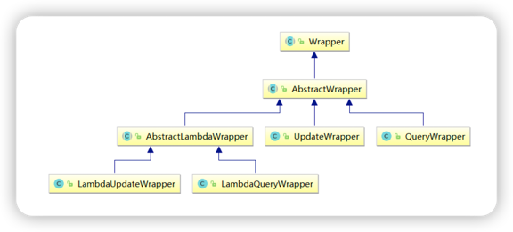

# 一、简介

官网：[http://mp.baomidou.com/](http://mp.baomidou.com/)
参考教程：[http://mp.baomidou.com/guide/](http://mp.baomidou.com/guide/)
MyBatis-Plus（简称 MP）是一个 MyBatis 的增强工具，在 MyBatis 的基础上只做增强不做改变，为简化开发、提高效率而生。

# 二、特性

- 无侵入：只做增强不做改变，引入它不会对现有工程产生影响，如丝般顺滑
- 损耗小：启动即会自动注入基本 CURD，性能基本无损耗，直接面向对象操作
- 强大的 CRUD 操作：内置通用 Mapper、通用 Service，仅仅通过少量配置即可实现单表大部分 CRUD 操作，更有强大的条件构造器，满足各类使用需求
- 支持 Lambda 形式调用：通过 Lambda 表达式，方便的编写各类查询条件，无需再担心字段写错
- 支持多种数据库：支持 MySQL、MariaDB、Oracle、DB2、H2、HSQL、SQLite、Postgre、SQLServer2005、SQLServer 等多种数据库
- 支持主键自动生成：支持多达 4 种主键策略（内含分布式唯一 ID 生成器 - Sequence），可自由配置，完美解决主键问题
- 支持 XML 热加载：Mapper 对应的 XML 支持热加载，对于简单的 CRUD 操作，甚至可以无 XML 启动
- 支持 ActiveRecord 模式：支持 ActiveRecord 形式调用，实体类只需继承 Model 类即可进行强大 的 CRUD 操作
- 支持自定义全局通用操作：支持全局通用方法注入（ Write once, use anywhere ）
- 支持关键词自动转义：支持数据库关键词（order、key......）自动转义，还可自定义关键词
- 内置代码生成器：采用代码或者 Maven 插件可快速生成 Mapper 、 Model 、 Service 、 Controller 层代码，支持模板引擎，更有超多自定义配置等您来使用
- 内置分页插件：基于 MyBatis 物理分页，开发者无需关心具体操作，配置好插件之后，写分页等同 于普通 List 查询
- 内置性能分析插件：可输出 Sql 语句以及其执行时间，建议开发测试时启用该功能，能快速揪出慢 查询
- 内置全局拦截插件：提供全表 delete 、 update 操作智能分析阻断，也可自定义拦截规则，预防误操作
- 内置 Sql 注入剥离器：支持 Sql 注入剥离，有效预防 Sql 注入攻击

### 主键策略

- 自动增长 AUTO INCREMENT
- UUID 每次生成随机的唯一值 排序不方便
- redis 实现
- MyBatis 自带策略 snowflake 算法 @TableId（type = IdType.AUTO）
    - 全局设置主键生成策略 mybatis-plus.global-config.db-config.id-type=auto
    - AUTO：自动增长
    - ID_WORKER：生成 19 位值，数字类型使用这种策略，比如 long
    - ID_WORKER_STR：生成 19 位值，字符串使用这种策略
    - INPUT：设置 id 值
    - NONE：输入
    - UUID：随机唯一值

### 自动填充

第一步：在实体类里面进行自动填充属性添加注解

```java

@Data
public class User {
    @TableField(fill = FieldFill.INSERT)
    private Date createTime;

    //@TableField(fill = FieldFill.UPDATE)
    @TableField(fill = FieldFill.INSERT_UPDATE)
    private Date updateTime;
}
```

第二步：创建类，实现接口 MetaObjectHandler 实现接口里面的方法

注意：不要忘记添加 @Component 注解

```java
package com.atguigu.mybatisplus.handler;

import com.baomidou.mybatisplus.core.handlers.MetaObjectHandler;
import org.apache.ibatis.reflection.MetaObject;
import org.slf4j.Logger;
import org.slf4j.LoggerFactory;
import org.springframework.stereotype.Component;

import java.util.Date;

@Component
public class MyMetaObjectHandler implements MetaObjectHandler {
    private static final Logger LOGGER =
            LoggerFactory.getLogger(MyMetaObjectHandler.class);

    //使用 mp 实现添加操作，执行这个方法
    @Override
    public void insertFill(MetaObject metaObject) {
        LOGGER.info("start insert fill ....");
        this.setFieldValByName("createTime", new Date(), metaObject);
        this.setFieldValByName("updateTime", new Date(), metaObject);
    }

    //使用 mp 实现修改操作，这个方法执行
    @Override
    public void updateFill(MetaObject metaObject) {
        LOGGER.info("start update fill ....");
        this.setFieldValByName("updateTime", new Date(), metaObject);
    }
}
```

### mp 实现乐观锁

主要适用场景：当要更新一条记录的时候，希望这条记录没有被别人更新，也就是说实现线程安全的数据更新

乐观锁实现方式：

- 取出记录时，获取当前version
- 更新时，带上这个version
- 执行更新时， set version = newVersion where version = oldVersion
- 如果version不对，就更新失败

1. 数据库中添加version字段
   `ALTER TABLE `user` ADD COLUMN `version` INT`
2. 实体类添加version字段 并添加 @Version 注解

```text
@Version
@TableField(fill = FieldFill.INSERT)
private Integer version;
```

3. 元对象处理器接口添加version的insert默认值

```text
@Override
public void insertFill(MetaObject metaObject){
    this.setFieldValByName("version",1,metaObject);
}
```

特别说明:

- 支持的数据类型只有 int,Integer,long,Long,Date,Timestamp,LocalDateTime
- 整数类型下 newVersion = oldVersion + 1
- newVersion 会回写到 entity 中
- 仅支持 updateById(id) 与 update(entity, wrapper) 方法
- 在 update(entity, wrapper) 方法下, wrapper 不能复用!!!

4. 在 MybatisPlusConfig 中注册乐观锁插件 Bean

```java
import com.baomidou.mybatisplus.extension.plugins.PaginationInterceptor;
import org.mybatis.spring.annotation.MapperScan;
import org.springframework.context.annotation.Bean;
import org.springframework.context.annotation.Configuration;
import org.springframework.transaction.annotation.EnableTransactionManagement;

@EnableTransactionManagement
@Configuration
@MapperScan("com.atguigu.mybatis_plus.mapper")
public class MybatisPlusConfig {
    /**
     * 乐观锁插件
     */
    @Bean
    public OptimisticLockerInterceptor optimisticLockerInterceptor() {
        return new OptimisticLockerInterceptor();
    }
}
```

### 性能分析插件

性能分析拦截器，用于输出每条 SQL 语句及其执行时间 SQL 性能执行分析,开发环境使用，超过指定时间，停止运行。有助于发现问题

1. 参数说明

- 参数：maxTime： SQL 执行最大时长，超过自动停止运行，有助于发现问题。
- 参数：format： SQL是否格式化，默认false。

2. 在 MybatisPlusConfig 中配置

```text
/**
 * SQL 执行性能分析插件
 * 开发环境使用，线上不推荐。 maxTime 指的是 sql 最大执行时长
 */
@Bean
@Profile({"dev", "test"})// 设置 dev test 环境开启
public PerformanceInterceptor performanceInterceptor(){
        PerformanceInterceptor performanceInterceptor=new PerformanceInterceptor();
        performanceInterceptor.setMaxTime(100);     //ms，超过此处设置的ms则sql不执行
        performanceInterceptor.setFormat(true);
        return performanceInterceptor;
        }
```

3. Spring Boot 中设置dev环境
   `#环境设置：dev、test、prod `
   `spring.profiles.active=dev`
    - dev:开发环境 test：测试环境 prod：生产环境
    - 可以针对各环境新建不同的配置文件application-dev.properties、application-test.properties、applicationprod.properties
    - 也可以自定义环境名称：如test1、test2

### Wrapper 介绍



- Wrapper ： 条件构造抽象类，最顶端父类
- AbstractWrapper ： 用于查询条件封装，生成 sql 的 where 条件
- QueryWrapper ： Entity 对象封装操作类，不是用 lambda 语法
- UpdateWrapper ： Update 条件封装，用于 Entity 对象更新操作
- AbstractLambdaWrapper ： Lambda 语法使用 Wrapper 统一处理解析 lambda 获取 column。
- LambdaQueryWrapper ：看名称也能明白就是用于 Lambda 语法使用的查询 Wrapper
- LambdaUpdateWrapper ： Lambda 更新封装 Wrapper

### 数据库设计

- 库名与应用名称尽量一致
- 表名、字段名必须使用小写字母或数字，禁止出现数字开头，
- 表名不使用复数名词
- 表的命名最好是加上“业务名称_表的作用”。如，edu_teacher
- 表必备三字段：id, gmt_create, gmt_modified
    - 说明： 其中 id 必为主键，类型为 bigint unsigned、单表时自增、步长为 1。 （如果使用分库分表集群部署，则id类型为 verchar，非自增，业务中使用分布式 id 生成器） gmt_create,
      gmt_modified 的类型均为 datetime 类型，前者现在时表示主动创建，后者过去分词表示被动更新。
- 单表行数超过 500 万行或者单表容量超过 2GB，才推荐进行分库分表。 说明：如果预计三年后的数 据量根本达不到这个级别，请不要在创建表时就分库分表。
- 表达是与否概念的字段，必须使用 is_xxx 的方式命名，数据类型是 unsigned tinyint （ 1 表示是，0 表示否）。
    - 说明：任何字段如果为非负数，必须是 unsigned。 注意：POJO 类中的任何布尔类型的变量，都不要加 is 前缀。数据库表示是与否的值，使用 tinyint 类型，坚持 is_xxx 的
      命名方式是为了明确其取值含义与取值范围。 正例：表达逻辑删除的字段名 is_deleted，1 表示删除，0 表示未删除。
- 小数类型为 decimal，禁止使用 float 和 double。 说明：float 和 double 在存储的时候，存在精度损失的问题，很可能在值的比较时，得到不正确的结果。如果存储的数据范围超过 decimal 的范围，建议
  将数据拆成整数和小数分开存储。
- 如果存储的字符串长度几乎相等，使用 char 定长字符串类型。
- varchar 是可变长字符串，不预先分配存储空间，长度不要超过 5000，如果存储长度大于此值，定义字段类型为 text，独立出来一张表，用主键来对应，避免影响其它字段索 引效率。
- 唯一索引名为 uk_字段名；普通索引名则为 idx_字段名。 说明：uk_ 即 unique key；idx_ 即 index 的简称
- 不得使用外键与级联，一切外键概念必须在应用层解决。外键与级联更新适用于单机低并发，不适合分布式、高并发集群；级联更新是强阻塞，存在数据库更新风暴的风险；外键影响数据库的插入速度。
- 外键需要设计进去，但是一般不声明出来，不然在数据库操作的时候有大问题，只能从小到大删除。

### 数据库优化冗余字段
