# 一、ECMAScript 6 简介

```text
ECMAScript 6.0（以下简称 ES6）是 JavaScript 语言的下一代标准，已经在 2015 年 6 月正式发布了。它的目
标，是使得 JavaScript 语言可以用来编写复杂的大型应用程序，成为企业级开发语言。
```

1. ECMAScript 和 JavaScript 的关系

```text
一个常见的问题是，ECMAScript 和 JavaScript 到底是什么关系？
要讲清楚这个问题，需要回顾历史。1996 年 11 月，JavaScript 的创造者 Netscape 公司，决定将 JavaScript 提
交给标准化组织 ECMA，希望这种语言能够成为国际标准。次年，ECMA 发布 262 号标准文件（ECMA-262）
的第一版，规定了浏览器脚本语言的标准，并将这种语言称为 ECMAScript，这个版本就是 1.0 版。
因此，ECMAScript 和 JavaScript 的关系是，前者是后者的规格，后者是前者的一种实现（另外的 ECMAScript
方言还有 Jscript 和 ActionScript）
```

2. ES6 与 ECMAScript 2015 的关系

```text
ECMAScript 2015（简称 ES2015）这个词，也是经常可以看到的。它与 ES6 是什么关系呢？
2011 年，ECMAScript 5.1 版发布后，就开始制定 6.0 版了。因此，ES6 这个词的原意，就是指 JavaScript 语言
的下一个版本。
ES6 的第一个版本，在 2015 年 6 月发布，正式名称是《ECMAScript 2015 标准》（简称 ES2015）。
2016 年 6 月，小幅修订的《ECMAScript 2016 标准》（简称 ES2016）如期发布，这个版本可以看作是 ES6.1
版，因为两者的差异非常小，基本上是同一个标准。根据计划，2017 年 6 月发布 ES2017 标准。
因此，ES6 既是一个历史名词，也是一个泛指，含义是 5.1 版以后的 JavaScript 的下一代标准，涵盖了
ES2015、ES2016、ES2017 等等，而 ES2015 则是正式名称，特指该年发布的正式版本的语言标准。本书中提到
ES6 的地方，一般是指 ES2015 标准，但有时也是泛指“下一代 JavaScript 语言”。
```

# 二、基本语法

ES标准中不包含 DOM 和 BOM的定义，只涵盖基本数据类型、关键字、语句、运算符、内建对象、内建函数等 通用语法。

1. let 声明变量

```javascript
// var 声明的变量没有局部作用域
// let 声明的变量 有局部作用域
{
    var a = 0;
    let b = 1;
}
console.log(a); // 0
console.log(b); // ReferenceError: b is not defined
```

2. const 声明常量（只读变量）

```javascript
// 1、声明之后不允许改变
const PI = "3.1415926"
PI = 3 // TypeError: Assignment to constant variable.

// 2、一但声明必须初始化，否则会报错
const MY_AGE // SyntaxError: Missing initializer in const declaration
```

3. 解构赋值

```text
解构赋值是对赋值运算符的扩展。
他是一种针对数组或者对象进行模式匹配，然后对其中的变量进行赋值。
在代码书写上简洁且易读，语义更加清晰明了；也方便了复杂对象中数据字段获取。
```

```javascript
//1、数组解构
// 传统
let a = 1, b = 2, c = 3
console.log(a, b, c)
// ES6
let [x, y, z] = [1, 2, 3]
console.log(x, y, z)

//2、对象解构
let user = {name: 'Helen', age: 18}
// 传统
let name1 = user.name
let age1 = user.age
console.log(name1, age1)
// ES6
let {name, age} = user//注意：结构的变量必须是user中的属性
console.log(name, age)
```

4. 模版字符串

模板字符串相当于加强版的字符串，用反引号 `,除了作为普通字符串，还可以用来定义多行字符串，还可以在字符串中加入变量和表达式。

```javascript
// 1、多行字符串
let string1 = `Hey, 
can you stop angry now?`
console.log(string1)
// Hey,
// can you stop angry now?

// 2、字符串插入变量和表达式。变量名写在 ${} 中，${} 中可以放入 JavaScript 表达式。
let name = "Mike"
let age = 27
let info = `My Name is ${name},I am ${age + 1} years old next year.`
console.log(info)
// My Name is Mike,I am 28 years old next year.

// 3、字符串中调用函数
function f() {
    return "have fun!"
}

let string2 = `Game start,${f()}`
console.log(string2); // Game start,have fun!
```

5. 声明对象简写

```javascript
const age = 12
const name = "Amy"
// 传统
const person1 = {age: age, name: name}
console.log(person1)
// ES6
const person2 = {age, name}
console.log(person2) //{age: 12, name: "Amy"}
```

6. 定义方法简写

```javascript
// 传统
const person1 = {
    sayHi: function () {
        console.log("Hi")
    }
}
person1.sayHi();//"Hi"
// ES6
const person2 = {
    sayHi() {
        console.log("Hi")
    }
}
person2.sayHi() //"Hi"
```

7. 对象拓展运算符

拓展运算符（...）用于取出参数对象所有可遍历属性然后拷贝到当前对象。

```javascript
// 1、拷贝对象
let person1 = {name: "Amy", age: 15}
let someone = {...person1}
console.log(someone) //{name: "Amy", age: 15}

// 2、合并对象
let age = {age: 15}
let name = {name: "Amy"}
let person2 = {...age, ...name}
console.log(person2) //{age: 15, name: "Amy"}
```

8. 箭头函数

箭头函数提供了一种更加简洁的函数书写方式。基本语法是：
`参数 => 函数体`

```javascript
// 传统
var f1 = function (a) {
    return a
}
console.log(f1(1))
// ES6
var f2 = a => a
console.log(f2(1))
```

```javascript
// 当箭头函数没有参数或者有多个参数，要用 () 括起来。
// 当箭头函数函数体有多行语句，用 {} 包裹起来，表示代码块，
// 当只有一行语句，并且需要返回结果时，可以省略 {} , 结果会自动返回。
var f3 = (a, b) => {
    let result = a + b
    return result
}
console.log(f3(6, 2)) // 8
// 前面代码相当于：
var f4 = (a, b) => a + b
```

# 三、Vue

### 1、基本语法

1. 基本数据渲染和指令

除了使用插值表达式{{}}进行数据渲染，也可以使用 v-bind指令，它的简写的形式就是一个冒号（:）

```javascript
data: {
    content: '我是标题';
    message: '页面加载于 ' + new Date().toLocaleString()
}
```

```html
<!-- 如果要将模型数据绑定在html属性中，则使用 v-bind 指令
      此时title中显示的是模型数据
-->
<h1 v-bind:title="message">
    {{content}}
</h1>

<!-- v-bind 指令的简写形式： 冒号（:） -->
<h1 :title="message">
    {{content}}
</h1>
```

2. 双向数据绑定

双向数据绑定和单向数据绑定：使用 v-model 进行双向数据绑定

```javascript
data: {
    searchMap:{
        keyWord: '尚硅谷'
    }
}
```

```html
<!-- v-bind:value只能进行单向的数据渲染 -->
<input type="text" v-bind:value="searchMap.keyWord">

<!-- v-model 可以进行双向的数据绑定 -->
<input type="text" v-model="searchMap.keyWord">

<p>您要查询的是：{{searchMap.keyWord}}</p>
```

3. 事件

在前面的例子基础上，data 节点中增加 result，增加 methods节点 并定义 search 方法

```javascript
data: {
    searchMap:{
        keyWord: '尚硅谷'
    }
    ;
    //查询结果
    result: {
    }
}
;
methods:{
    search()
    {
        console.log('search')
        //TODO
    }
}
```

html 中增加 button 和 p ，使用 v-on 进行数件处理，v-on:click 表示处理鼠标点击事件，事件调用的方法定义在 vue 对象声明 的 methods 节点中

```html
<!-- v-on 指令绑定事件，click指定绑定的事件类型，事件发生时调用vue中methods节点中定义的
方法 -->
<button v-on:click="search()">查询</button>
<!-- v-on 指令的简写形式 @ -->
<button @click="search()">查询</button>

<p>您要查询的是：{{searchMap.keyWord}}</p>
<p><a v-bind:href="result.site" target="_blank">{{result.title}}</a></p>
```

4. 修饰符

修饰符 (Modifiers) 是以半角句号（.）指明的特殊后缀，用于指出一个指令应该以特殊方式绑定。

例如，.prevent 修饰符告诉 v-on 指令对于触发的事件调用 event.preventDefault()： 即阻止事件原本的默认行为

```javascript
data:{
    user: {
    }
}
```

```html
<!-- 修饰符用于指出一个指令应该以特殊方式绑定。
这里的 .prevent 修饰符告诉 v-on 指令对于触发的事件调用js的
event.preventDefault()：
即阻止表单提交的默认行为 -->
<form action="save" v-on:submit.prevent="onSubmit">
    <label for="username">
        <input type="text" id="username" v-model="user.username">
        <button type="submit">保存</button>
    </label>
</form>

```

```javascript
methods: {
    onSubmit()
    {
        if (this.user.username) {
            console.log('提交表单')
        } else {
            alert('请输入用户名')
        }
    }
}
```

5. 条件渲染

```javascript
data: {
    ok: false
}
```

v-if：条件指令

```html
<input type="checkbox" v-model="ok">同意许可协议
<!-- v:if条件指令：还有v-else、v-else-if 切换开销大 -->
<h1 v-if="ok">if：Lorem ipsum dolor sit amet.</h1>
<h1 v-else>no</h1>
```

v-show：条件指令

```html
<!-- v:show 条件指令 初始渲染开销大 -->
<h1 v-show="ok">show：Lorem ipsum dolor sit amet.</h1>
<h1 v-show="!ok">no</h1>
```

- v-if 是“真正”的条件渲染，因为它会确保在切换过程中条件块内的事件监听器和子组件适当地被销毁和重建。
- v-if 也是惰性的：如果在初始渲染时条件为假，则什么也不做——直到条件第一次变为真时，才会开始渲染条件块。
- 相比之下，v-show 就简单得多——不管初始条件是什么，元素总是会被渲染，并且只是简单地基于 CSS 进行切换。
- 一般来说，v-if 有更高的切换开销，而 v-show 有更高的初始渲染开销。因此，如果需要非常频繁地切换，则使用 v-show 较好；如果在运行时条件很少改变，则使用 v-if 较好。

6. 列表渲染

v-for：列表循环指令

```html
<!-- 1、简单的列表渲染 -->
<ul>
    <li v-for="n in 10">{{ n }}</li>
</ul>
<ul>
    <!-- 如果想获取索引，则使用index关键字，注意，圆括号中的index必须放在后面 -->
    <li v-for="(n, index) in 5">{{ n }} - {{ index }}</li>
</ul>
```

```javascript
data: {
    userList: [
        {id: 1, username: 'helen', age: 18},
        {id: 2, username: 'peter', age: 28},
        {id: 3, username: 'andy', age: 38}
    ]
}
```

```html
<!-- 2、遍历数据列表 -->
<table border="1">
    <!-- <tr v-for="item in userList"></tr> -->
    <tr v-for="(item, index) in userList">
        <td>{{index}}</td>
        <td>{{item.id}}</td>
        <td>{{item.username}}</td>
        <td>{{item.age}}</td>
    </tr>
</table>
```

### 2、组件

```text
组件（Component）是 Vue.js 最强大的功能之一。
组件可以扩展 HTML 元素，封装可重用的代码。
组件系统让我们可以用独立可复用的小组件来构建大型应用，几乎任意类型的应用的界面都可以抽象为一个组件树：
```


1. 局部组件

```javascript
var app = new Vue({
    el: '#app',
// 定义局部组件，这里可以定义多个局部组件
    components: {
//组件的名字
        'Navbar': {
//组件的内容
            template: '<ul><li>首页</li><li>学员管理</li></ul>'
        }
    }
})
```

```html

<div id="app">
    <Navbar></Navbar>
</div>
```

2. 全局组件

定义全局组件：components/Navbar.js

```javascript
// 定义全局组件
Vue.component('Navbar', {
    template: '<ul><li>首页</li><li>学员管理</li><li>讲师管理</li></ul>'
})
```

```html

<div id="app">
    <Navbar></Navbar>
</div>
<script src="vue.min.js"></script>
<script src="components/Navbar.js"></script>
<script>
    var app = new Vue({
        el: '#app'
    })
</script>
```

### 3、路由

```html
Vue.js 路由允许我们通过不同的 URL 访问不同的内容。
通过 Vue.js 可以实现多视图的单页Web应用（single page web application，SPA）。
Vue.js 路由需要载入 vue-router 库
```

1. 引入 js

```javascript
<script src="vue.min.js"></script>
<script src="vue-router.min.js"></script>
```

2. 编写 html

```html

<div id="app">
    <h1>Hello App!</h1>
    <p>
        <!-- 使用 router-link 组件来导航. -->
        <!-- 通过传入 `to` 属性指定链接. -->
        <!-- <router-link> 默认会被渲染成一个 `<a>` 标签 -->
        <router-link to="/">首页</router-link>
        <router-link to="/student">会员管理</router-link>
        <router-link to="/teacher">讲师管理</router-link>
    </p>
    <!-- 路由出口 -->
    <!-- 路由匹配到的组件将渲染在这里 -->
    <router-view></router-view>
</div>
```

3. 编写js

```javascript
<script>
    // 1. 定义（路由）组件。
    // 可以从其他文件 import 进来
    const Welcome = {template: '<div>欢迎</div>'}
    const Student = {template: '<div>student list</div>'}
    const Teacher = {template: '<div>teacher list</div>'}
    // 2. 定义路由
    // 每个路由应该映射一个组件。
    const routes = [
    {path: '/', redirect: '/welcome'}, //设置默认指向的路径
    {path: '/welcome', component: Welcome},
    {path: '/student', component: Student},
    {path: '/teacher', component: Teacher}
    ]
    // 3. 创建 router 实例，然后传 `routes` 配置
    const router = new VueRouter({
    routes // （缩写）相当于 routes: routes
})
    // 4. 创建和挂载根实例。
    // 从而让整个应用都有路由功能
    const app = new Vue({
    el: '#app',
    router
})
    // 现在，应用已经启动了！
</script>
```

### 4、axios

axios 是独立于 vue 的一个项目，基于 promise 用于浏览器和 node.js 的 http 客户端

- 在浏览器中可以帮助我们完成 ajax 请求的发送
- 在 node.js 中可以向远程接口发送请求

1. 获取数据

```html

<script src="vue.min.js"></script>
<script src="axios.min.js"></script>
```

```javascript
var app = new Vue({
    el: '#app',
    data: {
        memberList: []//数组
    },
    created() {
        this.getList()
    },
    methods: {
        getList(id) {
            //vm = this
            axios.get('http://localhost:8081/admin/ucenter/member')
                .then(response => {
                    console.log(response)
                    this.memberList = response.data.data.items
                })
                .catch(error => {
                    console.log(error)
                })
        }
    }
})
```

2. 显示数据

```html

<div id="app">
    <table border="1">
        <tr>
            <td>id</td>
            <td>姓名</td>
        </tr>
        <tr v-for="item in memberList">
            <td>{{item.memberId}}</td>
            <td>{{item.nickname}}</td>
            </td>
        </tr>
    </table>
</div>
```

### 5、element-ui

element-ui 是饿了么前端出品的基于 Vue.js 的后台组件库，方便程序员进行页面快速布局和构建

官网： [http://element-cn.eleme.io/#/zh-CN](http://element-cn.eleme.io/#/zh-CN)

1. 引入 css

```javascript
<!-- import CSS -->
<link rel="stylesheet" href="element-ui/lib/theme-chalk/index.css">
```

2. 引入js

```javascript
<!-- import Vue before Element -->
<script src="vue.min.js"></script>
<!-- import JavaScript -->
<script src="element-ui/lib/index.js"></script>
```

3. 编写html

```html

<div id="app">
    <el-button @click="visible = true">Button</el-button>
    <el-dialog :visible.sync="visible" title="Hello world">
        <p>Try Element</p>
    </el-dialog>
</div>
```

4. 编写js

```javascript
<script>
    new Vue({
    el: '#app',
    data: function () {//定义Vue中data的另一种方式
    return {visible: false}
}
})
</script>
```

# 四、Node.js

Node.js 是一个事件驱动 I/O 服务端 JavaScript 环境，基于 Google 的 V8 引擎，V8 引擎执行 Javascript 的速度非常快，性能非常好。

1. 安装

官网：[https://nodejs.org/en/](https://nodejs.org/en/)
中文网：[http://nodejs.cn/](http://nodejs.cn/)
LTS：长期支持版本 Current：最新版

2. 查看版本 `node -v`

3. 快速入门

- 创建文件夹 nodejs
- 控制台程序

创建 01-控制台程序.js  `console.log('Hello Node.js')`
打开命令行终端：`Ctrl + Shift + y`
进入到程序所在的目录，输入 `node 01-控制台程序.js`
浏览器的内核包括两部分核心：

```text
- DOM渲染引擎； 
- js解析器（js引擎） 
- js运行在浏览器中的内核中的js引擎内部 
```

Node.js是脱离浏览器环境运行的JavaScript程序，基于V8 引擎（Chrome 的 JavaScript的引擎）

- 服务器端应用开发

创建 02-server-app.js

```javascript
const http = require('http');
http.createServer(function (request, response) {
    // 发送 HTTP 头部
    // HTTP 状态值: 200 : OK
    // 内容类型: text/plain
    response.writeHead(200, {'Content-Type': 'text/plain'});
    // 发送响应数据 "Hello World"
    response.end('Hello Server');
}).listen(8888);
// 终端打印如下信息
console.log('Server running at http://127.0.0.1:8888/');
```

运行服务器程序`node 02-server-app.js`
服务器启动成功后，在浏览器中输入：http://localhost:8888/ 查看 webserver 成功运行，并输出html页面 停止服务：ctrl + c

# 五、NPM

NPM 全称 Node Package Manager，是 Node.js 包管理工具，是全球最大的模块生态系统，里面所有的模块都是开源免费的；也是 Node.js 的包管理工具，相当于前端的 Maven 。

### 1、使用 npm 管理项目

1. 创建文件夹 npm
2. 项目初始化

```shell
#建立一个空文件夹，在命令提示符进入该文件夹 执行命令初始化
npm init
#按照提示输入相关信息，如果是用默认值则直接回车即可。
#name: 项目名称
#version: 项目版本号
#description: 项目描述
#keywords: {Array}关键词，便于用户搜索到我们的项目
#最后会生成package.json文件，这个是包的配置文件，相当于maven的pom.xml
#我们之后也可以根据需要进行修改。
# 如果想直接生成 package.json 文件，那么可以使用命令
npm init -y
```

3. 修改 npm 镜像

NPM官方的管理的包都是从 [http://npmjs.com](http://npmjs.com) 下载的，但是这个网站在国内速度很慢。

这里推荐使用淘宝 NPM 镜像 [http://npm.taobao.org/](http://npm.taobao.org/) ，淘宝 NPM 镜像是一个完整 npmjs.com 镜像，同步频率目前为
10分钟一次，以保证尽量与官方服务同步。

```shell
#经过下面的配置，以后所有的 npm install 都会经过淘宝的镜像地址下载
npm config set registry https://registry.npm.taobao.org
#查看npm配置信息
npm config list
```

4. npm install 命令的使用

```shell
#使用 npm install 安装依赖包的最新版，
#模块安装的位置：项目目录\node_modules
#安装会自动在项目目录下添加 package-lock.json文件，这个文件帮助锁定安装包的版本
#同时package.json 文件中，依赖包会被添加到dependencies节点下，类似maven中的
<dependencies>
npm install jquery
#npm管理的项目在备份和传输的时候一般不携带node_modules文件夹
npm install 
#根据package.json中的配置下载依赖，初始化项目
#如果安装时想指定特定的版本
npm install jquery@2.1.x
#devDependencies 节点：开发时的依赖包，项目打包到生产环境的时候不包含的依赖
#使用 -D 参数将依赖添加到 devDependencies 节点
npm install --save-dev eslint
#或
npm install -D eslint
#全局安装
#Node.js 全局安装的 npm 包和工具的位置：用户目录\AppData\Roaming\npm\node_modules
#一些命令行工具常使用全局安装的方式
npm install -g webpack
```

5. 其他命令

```shell
#更新包（更新到最新版本）
npm update 包名
#全局更新
npm update -g 包名
#卸载包
npm uninstall 包名
#全局卸载
npm uninstall -g 包名
```

# 六、Babel

Babel 是一个广泛使用的转码器，可以将 ES6 代码转为 ES5 代码，从而在现有环境执行。 这意味着，你可以现在就用 ES6 编写程序，而不用担心现有环境是否支持。

1. 安装

```shell
# Babel 提供 babel-cli 工具，用于命令行转码
npm install --global babel-cli
#查看是否安装成功
babel --version
```

2. 初始化项目 `npm init -y`
3. 创建文件

```javascript
// 转码前
// 定义数据
let input = [1, 2, 3]
// 将数组的每个元素 +1
input = input.map(item => item + 1)
console.log(input)
```

4. 配置 .babelrc

Babel的配置文件是.babelrc，存放在项目的根目录下，该文件用来设置转码规则和插件，基本格式如 下。

```text
{
    "presets": [],
    "plugins": []
}
```

presets 字段设定转码规则，将 es2015 规则加入 .babelrc：

```text
{
    "presets": ["es2015"],
    "plugins": []
}
```

5. 安装转码器 `npm install --save-dev babel-preset-es2015`
6. 转码

```shell
# 转码结果写入一个文件
mkdir dist1
# --out-file 或 -o 参数指定输出文件
babel src/example.js --out-file dist1/compiled.js
# 或者
babel src/example.js -o dist1/compiled.js
# 整个目录转码
mkdir dist2
# --out-dir 或 -d 参数指定输出目录
babel src --out-dir dist2
# 或者
babel src -d dist2
```

# 七、模块化

### CommonJS模块规范

每个文件就是一个模块，有自己的作用域。在一个文件里面定义的变量、函数、类，都是私有的，对其他文件不可见。

1. 创建 "module" 文件夹

创建 common-js模块化/四则运算.js

```javascript
// 定义成员：
const sum = function (a, b) {
    return parseInt(a) + parseInt(b)
}
const subtract = function (a, b) {
    return parseInt(a) - parseInt(b)
}
const multiply = function (a, b) {
    return parseInt(a) * parseInt(b)
}
const divide = function (a, b) {
    return parseInt(a) / parseInt(b)
}
```

2. 导出模块

导出模块中的成员

```javascript
// 导出成员：
module.exports = {
    sum: sum,
    subtract: subtract,
    multiply: multiply,
    divide: divide
}

//简写
module.exports = {
    sum,
    subtract,
    multiply,
    divide
}
```

3. 导入模块

创建 common-js模块化/引入模块.js

```javascript
//引入模块，注意：当前路径必须写 ./
const m = require('./四则运算.js')
console.log(m)
const result1 = m.sum(1, 2)
const result2 = m.subtract(1, 2)
console.log(result1, result2)
```

4. 运行程序 `node common-js模块化/引入模块.js`

### ES6 中模块化

1. 导出模块

创建 es6 模块化 /userApi2.js

```javascript
export default {
    getList() {
        console.log('获取数据列表2')
    },
    save() {
        console.log('保存数据2')
    }
}
```

2. 导入模块

创建 es6 模块化 /userComponent2.js

```javascript
import user from "./userApi2.js"

user.getList()
user.save()  
```

# 八、Webpack

Webpack 是一个前端资源加载/打包工具。它将根据模块的依赖关系进行静态分析，然后将这些模块按 照指定的规则生成对应的静态资源。

1. 全局安装  `npm install -g webpack webpack-cli`
2. 安装后查看版本号  `webpack -v`
3. 创建 webpack 文件夹  `npm init -y`
4. 创建 src 文件夹
5. src 下创建 commom.js

```javascript
exports.info = function (str) {
    document.write(str);
}
```

6. src 下创建 utils.js

```javascript
exports.add = function (a, b) {
    return a + b;
}
```

7. src下创建main.js

```javascript
const common = require('./common');
const utils = require('./utils');
common.info('Hello world!' + utils.add(100, 200));
```

### 1、JS 打包

1. webpack 目录下创建配置文件 webpack.config.js

```javascript
//读取当前项目目录下 src 文件夹中的 main.js（入口文件）内容，分析资源依赖，把相关的 js 文件打包，打包后的文件放入当前目录的 dist 文件夹下，打包后的 js 文件名为 bundle.js
const path = require("path"); //Node.js内置模块
module.exports = {
    entry: './src/main.js', //配置入口文件
    output: {
        path: path.resolve(__dirname, './dist'), //输出路径，__dirname：当前文件所在路径
        filename: 'bundle.js' //输出文件
    }
}
```

2. 命令行执行编译命令

```shell
webpack #有黄色警告
webpack --mode=development #没有警告
#执行后查看 bundle.js 里面包含了上面两个 js 文件的内容并进行了代码压缩
```

```json
//也可以配置项目的npm运行命令，修改package.json文件
"scripts": {
"dev": "webpack --mode=development"
}
```

运行npm命令执行打包 `npm run dev`

3. webpack 目录下创建 index.html

```html

<body>
<script src="dist/bundle.js"></script>
</body>
```

4. 浏览器中查看 index.html

### 2、CSS 打包

1. 安装 style-loader 和 css-loader

Webpack 本身只能处理 JavaScript 模块，如果要处理其他类型的文件，就需要使用 loader 进行转换。

Loader 可以理解为是模块和资源的转换器。

首先我们需要安装相关Loader插件，css-loader 是将 css 装载到 javascript；style-loader 是让 javascript
认识css `npm install --save-dev style-loader css-loader`

2. 修改 webpack.config.js

```javascript
const path = require("path"); //Node.js内置模块
module.exports = {
//...,
    output: {},
    module: {
        rules: [
            {
                test: /\.css$/, //打包规则应用到以css结尾的文件上
                use: ['style-loader', 'css-loader']
            }]
    }
}
```

3. 在 src 文件夹创建 style.css
   `body{ background:pink; }`
4. 修改main.js
   `require('./style.css');`
5. 浏览器中查看 index.html

# 九、Vue

### 1、vue-element-admin

而 vue-element-admin 是基于 element-ui 的一套后台管理系统集成方案。
功能：[https://panjiachen.github.io/vue-element-admin-site/zh/guide/#功能](https://panjiachen.github.io/vue-element-admin-site/zh/guide/#功能)
GitHub地址：[https://github.com/PanJiaChen/vue-element-admin](https://github.com/PanJiaChen/vue-element-admin)
项目在线预览：[https://panjiachen.gitee.io/vue-element-admin](https://panjiachen.gitee.io/vue-element-admin)

安装

```shell
# 解压压缩包
# 进入目录
cd vue-element-admin-master
# 安装依赖
npm install
# 启动。执行后，浏览器自动弹出并访问http://localhost:9527/
npm run dev
```

### 2、vue-admin-template

vue-admin-template 是基于 vue-element-admin 的一套后台管理系统基础模板（最少精简版），可作为模板进行二次开发。
GitHub地址：[https://github.com/PanJiaChen/vue-admin-template](https://github.com/PanJiaChen/vue-admin-template)
建议：你可以在 vue-admin-template 的基础上进行二次开发，把 vue-element-admin 当做工具箱，想要什么功能或者组件就去 vue-element-admin 那里复制过来。

安装

```shell
# 解压压缩包
# 进入目录
cd vue-admin-template-master
# 安装依赖
npm install
# 启动。执行后，浏览器自动弹出并访问http://localhost:9528/
npm run dev
```

### 3、项目的创建和基本配置

1. 创建项目

将 vue-admin-template-master 重命名为 guli-admin

2. 修改项目信息`package.json`

```json
{
  "name": "guli-admin",
  ......
  "description": "谷粒学院后台管理系统",
  "author": "Helen <55317332@qq.com>",
  ......
}
```

3. 如果需要修改端口号 `config/index.js` 中修改 `port: 9528`
4. 项目的目录结构

```text
├── build // 构建脚本
├── config // 全局配置
├── node_modules // 项目依赖模块
├── src //项目源代码
├── static // 静态资源
└── package.jspon // 项目信息和依赖配置
```

```text
src
├── api // 各种接口
├── assets // 图片等资源
├── components // 各种公共组件，非公共组件在各自 view 下维护
├── icons //svg icon
├── router // 路由表
├── store // 存储
├── styles // 各种样式
├── utils // 公共工具，非公共工具，在各自 view 下维护
├── views // 各种layout
├── App.vue //项目顶层组件
├── main.js //项目入口文件
└── permission.js //认证入口
```

5. 运行项目`npm run dev`

### 4、登陆页修改`src/views/login/index.vue`

### 5、页面零星修改

1. 标题`index.html`
2. 国际化设置

打开 src/main.js（项目的js入口），第7行，修改语言为 zh-CN，使用中文语言环境，例如：日期时间组
件`import locale from 'element-ui/lib/locale/lang/zh-CN' // lang i18n`

3. 修改 icon，复制 favicon.ico 到根目录
4. 导航栏文字

`src/views/layout/components（当前项目的布局组件）`
`src/views/layout/components/Navbar.vue`

5. 面包屑文字

`src/components（可以在很多项目中复用的通用组件）`
`src/components/Breadcrumb/index.vue`
`meta: { title: '首页' }`

### 6、Eslint语法规范型检查

1. Eslint 简介

```text
JavaScript 是一个动态的弱类型语言，在开发中比较容易出错。因为没有编译程序，为了寻找 JavaScript 代码错误通常需要在执行过程中不断调适。
ESLint 是一个语法规则和代码风格的检查工具，可以用来保证写出语法正确、风格统一的代码。让程序员在编码的过程中发现问题而不是在执行的过程中。
```

2. 语法规则

本项目的语法规则包括：两个字符缩进，必须使用单引号，不能使用双引号，语句后不可以写分号，代码段之间必须有一个空行等。

3. 确认开启语法检查

打开 config/index.js，配置是否开启语法检查`useEslint: true`

4. ESLint插件安装
5. 插件的扩展设置

选择 VSCode 左下角的“设置”， 打开 VSCode 配置文件,添加如下配置
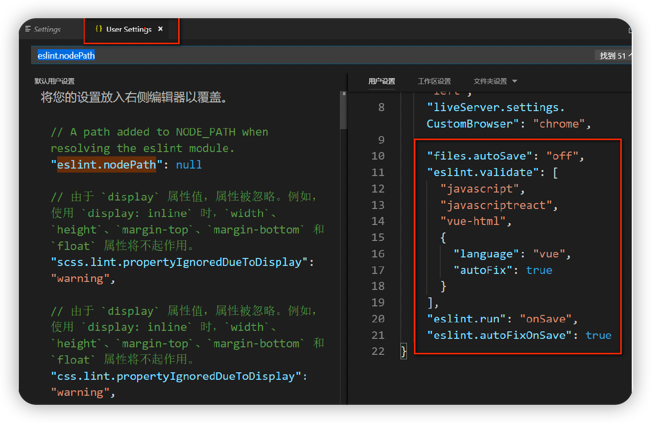

```json
"files.autoSave": "off",
"eslint.validate": [
"javascript",
"javascriptreact",
"vue-html",
{
"language": "vue",
"autoFix": true
}
],
"eslint.run": "onSave",
"eslint.autoFixOnSave": true
```

### 7、修改项目中的 easy-mock

config/dev.env.js 中 BASE_API 为项目的easymock地址，目前具有模拟登录、登出、获取用户信息的功
能 `BASE_API: '"https://easy-mock.com/mock/5950a2419adc231f356a6636/vue-admin"'`

- 登录：/user/login
- 获取用户信息：/user/info?token=admin
- 登出：/user/logout
- config/dev.env.js，只有一个api地址的配置位置，而我们实际的后端有很多微服务，所以接口地址有很 多， 我们可以使用nginx反向代理让不同的api路径分发到不同的api服务器中

### 8、配置 nginx 反向代理

1. 安装window版的nginx
2. 配置nginx代理

```text
http {
    server {
        listen 81;
        ......
    }，
    ......
    server {
        listen 8201;
        server_name localhost;
        location ~ /edu/ {
            proxy_pass http://localhost:8101;
        }
        location ~ /user/ {
            rewrite /(.+)$ /mock/5950a2419adc231f356a6636/vue-admin/$1
break;
            proxy_pass https://www.easy-mock.com;
        }
    }
}
```

3. 重启nginx `nginx -s reload`
4. 测试

访问讲师列表接口：[http://localhost:8201/admin/edu/teacher](http://localhost:8201/admin/edu/teacher)
访问获取用户信息接口：[http://localhost:8201/user/info?token=admin](http://localhost:8201/user/info?token=admin)

### 9、配置开发环境

1. 修改 config/dev.env.js
   `BASE_API: '"http://127.0.0.1:8201"'`
2. 重启前端程序

# 十、跨域问题

```text
协议：http https
ip 地址：192.168.1.1   172.11.11
端口号：9528    8001
有一个不一样就会有跨域问题
```

1. 在后端接口 controller 添加注解（常用） `@CrossOrign`
2. 使用网关解决

# 十一、前端框架开发

### 1、添加路由 `src -> router ——> index.js`

### 2、点击某个路由，显示路由对应页面内容

### 3、 开发案例之分页列表

1. 定义api

创建文件 `src/api/edu/teacher.js`

```javascript
import request from '@/utils/request'

const api_name = '/admin/edu/teacher'
export default {
    getPageList(page, limit, searchObj) {
        return request({
            url: `${api_name}/${page}/${limit}`,
            method: 'get',
            data: searchObj
        })
    }
}
```

2. 初始化vue组件

`src/views/edu/teacher/list.vue`

```html

<template>
    <div class="app-container">
        讲师列表
    </div>
</template>
<script>
    import teacher from '@/api/edu/teacher'

    export default {
        data() {// 定义数据
            return {}
        },
        created() { // 当页面加载时获取数据
            this.fetchData()
        }, methods: {
            fetchData() { // 调用api层获取数据库中的数据
                console.log('加载列表')
            }
        }
    }
</script>
```

3. 定义data

```javascript
data()
{
    return {
        listLoading: true, // 是否显示loading信息
        list: null, // 数据列表
        total: 0, // 总记录数
        page: 1, // 页码
        limit: 10, // 每页记录数
        searchObj: {}// 查询条件
    }
}
,
```

4. 定义methods

```javascript
methods: {
    fetchData(page = 1)
    { // 调用api层获取数据库中的数据
        console.log('加载列表')
        this.page = page
        this.listLoading = true
        teacher.getPageList(this.page, this.limit, this.searchObj)
            .then(response => {// debugger 设置断点调试
                if (response.success === true) {
                    this.list = response.data.rows
                    this.total = response.data.total
                }
                this.listLoading = false
            })
    }
}
```

5. 表格渲染

```html
<!-- 表格 -->
<el-table
        v-loading="listLoading"
        :data="list"
        element-loading-text="数据加载中"
        border
        fit
        highlight-current-row>
    <el-table-column
            label="序号"
            width="70"
            align="center">
        <template slot-scope="scope">
            {{ (page - 1) * limit + scope.$index + 1 }}
        </template>
    </el-table-column>
    <el-table-column prop="name" label="名称" width="80"/>
    <el-table-column label="头衔" width="80">
        <template slot-scope="scope">
            {{ scope.row.level===1?'高级讲师':'首席讲师' }}
        </template>
    </el-table-column>
    <el-table-column prop="intro" label="资历"/>
    <el-table-column prop="gmtCreate" label="添加时间" width="160"/>
    <el-table-column prop="sort" label="排序" width="60"/>
    <el-table-column label="操作" width="200" align="center">
        <template slot-scope="scope">
            <router-link :to="'/edu/teacher/edit/'+scope.row.id">
                <el-button type="primary" size="mini" icon="el-icon-edit">修改</elbutton>
            </router-link>
            <el-button type="danger" size="mini" icon="el-icon-delete"
                       @click="removeDataById(scope.row.id)">删除
            </el-button>
        </template>
    </el-table-column>
</el-table>
```

6. 分页组件

```html
<!-- 分页 -->
<!--
 current-page 当前页
 page-size 每页记录数
 total  总记录数
 @current-change 分页方法
 -->
<el-pagination
        :current-page="page"
        :page-size="limit"
        :total="total"
        style="padding: 30px 0; text-align: center;"
        layout="total, prev, pager, next, jumper"
        @current-change="fetchData"
/>
```

7. 顶部查询表单

element-ui 的 date-picker组件默认绑定的时间值是默认世界标准时间，和中国时间差8小时 设置 `value-format="yyyy-MM-dd HH:mm:ss"` 改变绑定的值

```html
<!--查询表单-->
<el-form :inline="true" class="demo-form-inline">
    <el-form-item>
        <el-input v-model="searchObj.name" placeholder="讲师名"/>
    </el-form-item>
    <el-form-item>
        <el-select v-model="searchObj.level" clearable placeholder="讲师头衔">
            <el-option :value="1" label="高级讲师"/>
            <el-option :value="2" label="首席讲师"/>
        </el-select>
    </el-form-item>
    <el-form-item label="添加时间">
        <el-date-picker
                v-model="searchObj.begin"
                type="datetime"
                placeholder="选择开始时间"
                value-format="yyyy-MM-dd HH:mm:ss"
                default-time="00:00:00"
        />
    </el-form-item>
    <el-form-item>
        <el-date-picker
                v-model="searchObj.end"
                type="datetime"
                placeholder="选择截止时间"
                value-format="yyyy-MM-dd HH:mm:ss"
                default-time="00:00:00"
        />
    </el-form-item>
    <el-button type="primary" icon="el-icon-search" @click="fetchData()">查
        询
    </el-button>
    <el-button type="default" @click="resetData()">清空</el-button>
</el-form>
```

清空方法

```javascript
resetData()
{
    this.searchObj = {}
    this.fetchData()
}
```

8. 测试

### 4、 开发案例之删除

`@click = removeDataById(scope.row.id)`

1. 定义api

`src/api/edu/teacher.js`

```javascript
removeById(teacherId)
{
    return request({
        url: `/eduservice/teacher/${id}`,
        method: 'delete'
    })
}
```

2. 定义 methods

`src/views/edu/teacher/list.vue`
使用MessageBox 弹框组件

```javascript
removeDataById(id)
{
// debugger
// console.log(memberId)
    this.$confirm('此操作将永久删除该记录, 是否继续?', '提示', {
        confirmButtonText: '确定',
        cancelButtonText: '取消',
        type: 'warning'
    }).then(() => {
        return teacher.removeById(id)
    }).then(() => {
        this.fetchData()
        this.$message({
            type: 'success',
            message: '删除成功!'
        })
    }).catch((response) => { // 失败
        if (response === 'cancel') {
            this.$message({
                type: 'info',
                message: '已取消删除'
            })
        } else {
            this.$message({
                type: 'error',
                message: '删除失败'
            })
        }
    })
}
```

### 5、 开发案例之新增

1. 定义 api `src/api/edu/teacher.js`

```javascript
save(teacher)
{
    return request({
        url: api_name,
        method: 'post',
        data: teacher
    })
}
```

2. 初始化组件 `src/views/edu/teacher/form.vue`

```html

<template>
    <div class="app-container">
        <el-form label-width="120px">
            <el-form-item label="讲师名称">
                <el-input v-model="teacher.name"/>
            </el-form-item>
            <el-form-item label="讲师排序">
                <el-input-number v-model="teacher.sort" controls-position="right"
                                 min="0"/>
            </el-form-item>
            <el-form-item label="讲师头衔">
                <el-select v-model="teacher.level" clearable placeholder="请选择">
                    <!--
                    数据类型一定要和取出的json中的一致，否则没法回填
                    因此，这里value使用动态绑定的值，保证其数据类型是number
                    -->
                    <el-option :value="1" label="高级讲师"/>
                    <el-option :value="2" label="首席讲师"/>
                </el-select>
            </el-form-item>
            <el-form-item label="讲师资历">
                <el-input v-model="teacher.career"/>
            </el-form-item>
            <el-form-item label="讲师简介">
                <el-input v-model="teacher.intro" :rows="10" type="textarea"/>
            </el-form-item>
            <!-- 讲师头像：TODO -->
            <el-form-item>
                <el-button :disabled="saveBtnDisabled" type="primary"
                           @click="saveOrUpdate">保存
                </el-button>
            </el-form-item>
        </el-form>
    </div>
</template>
```

```javascript
<script>
    export default {
    data() {
    return {
    teacher: {
    name: '',
    sort: 0,
    level: 1,
    career: '',
    intro: '',
    avatar: ''
},
    saveBtnDisabled: false // 保存按钮是否禁用,
}
},
    methods: {
    saveOrUpdate() {
    this.saveBtnDisabled = true
    this.saveData()
},
// 保存
    saveData() {
}
}
}</script>
```

3. 实现新增功能

引入 teacher api 模块 `import teacher from '@/api/edu/teacher`
完善 save 方法

```javascript
// 保存
saveData()
{
    teacher.save(this.teacher).then(response => {
        return this.$message({
            type: 'success',
            message: '保存成功!'
        })
    }).then(resposne => {
        this.$router.push({path: '/edu/teacher'})
    }).catch((response) => {
// console.log(response)
        this.$message({
            type: 'error',
            message: '保存失败'
        })
    })
}
```

4. 存在问题

vue-router导航切换 时，如果两个路由都渲染同个组件，组件会重（chong）用, 组件的生命周期钩子（created）不会再被调用, 使得组件的一些数据无法根据 path的改变得到更新

- 我们可以在watch中监听路由的变化，当路由变化时，重新调用created中的内容
- 在init方法中我们判断路由的变化，如果是修改路由，则从api获取表单数据，如果是新增路由，则重新初始化表单数据

```javascript
<script>
    import teacher from '@/api/edu/teacher'
    const defaultForm = {
    name: '',
    sort: 0,
    level: '',
    career: '',
    intro: '',
    avatar: ''
}
    export default {
    data() {
    return {
    teacher: defaultForm,
    saveBtnDisabled: false // 保存按钮是否禁用,
}
},
    watch: {
    $route(to, from) {
    console.log('watch $route')
    this.init()
}
},
    created() {
    console.log('created')
    this.init()
},
    methods: {
    init() {
    if (this.$route.params && this.$route.params.id) {
    const id = this.$route.params.id
    this.fetchDataById(id)
} else {
// 使用对象拓展运算符，拷贝对象，而不是引用，
// 否则新增一条记录后，defaultForm就变成了之前新增的teacher的值
    this.teacher = {...defaultForm}
}
},
    ......
}
}
</script>
```

# 十二、对象存储OSS

为了解决海量数据存储与弹性扩容，项目中我们采用云存储的解决方案--阿里云OSS。

1. 开通“对象存储OSS”服务

- 申请阿里云账号
- 实名认证
- 开通“对象存储OSS”服务
- 进入管理控制台

2. 创建 Bucket
   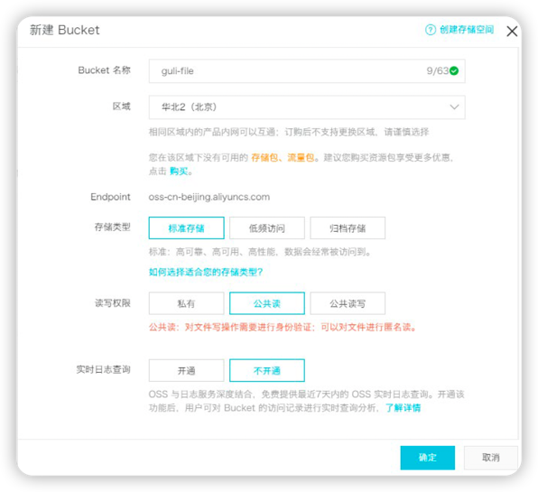
3. 上传默认头像

创建文件夹avatar，上传默认的用户头像
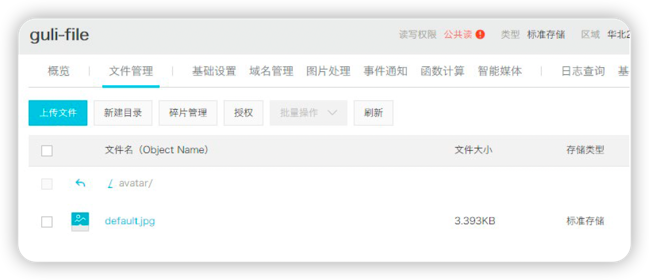

4. 创建 RAM 子用户
   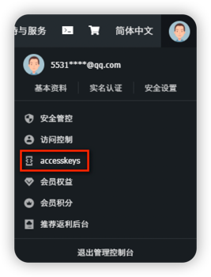

### 2、使用 SDK

首页 ——> 学习路径 ——> 开发者资源 ——>  Java SDK
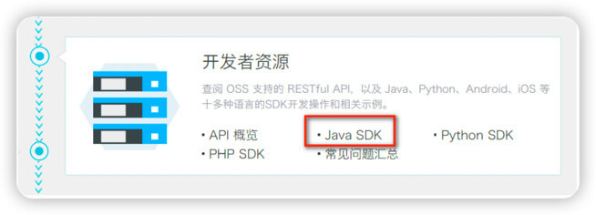

1. 创建Mavaen项目 `com.atguigu.aliyun-oss`
2. pom

```xml

<dependencies>
    <!--aliyunOSS-->
    <dependency>
        <groupId>com.aliyun.oss</groupId>
        <artifactId>aliyun-sdk-oss</artifactId>
        <version>2.8.3</version>
    </dependency>

    <dependency>
        <groupId>junit</groupId>
        <artifactId>junit</artifactId>
        <version>4.12</version>
    </dependency>
</dependencies>
```

3. 找到编码时需要用到的常量值
    - endpoint
    - bucketName
    - accessKeyId
    - accessKeySecret
4. 测试创建Bucket的连接
   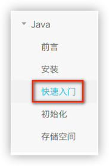

```java
public class OSSTest {
    // Endpoint以杭州为例，其它Region请按实际情况填写。
    String endpoint = "your endpoint";
    // 阿里云主账号AccessKey拥有所有API的访问权限，风险很高。强烈建议您创建并使用RAM账号进行API访问号。
    String accessKeyId = "your accessKeyId";
    String accessKeySecret = "your accessKeySecret";
    String bucketName = "guli-file";

    @Test
    public void testCreateBucket() {
        // 创建OSSClient实例。
        OSSClient ossClient = new OSSClient(endpoint, accessKeyId, accessKeySecret);
        // 创建存储空间。
        ossClient.createBucket(bucketName);
        // 关闭OSSClient。
        ossClient.shutdown();
    }
}
```

5. 判断存储空间是否存在
   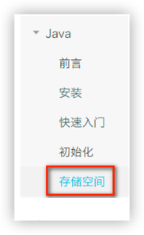

```text
@Test
public void testExist(){
        // 创建OSSClient实例。
        OSSClient ossClient=new OSSClient(endpoint,accessKeyId,accessKeySecret);
        
        boolean exists=ossClient.doesBucketExist(bucketName);
        System.out.println(exists);
        
        // 关闭OSSClient。
        ossClient.shutdown();
        }
```

6. 设置存储空间的访问权限

```text
@Test
public void testAccessControl(){
        // 创建OSSClient实例。
        OSSClient ossClient=new OSSClient(endpoint,accessKeyId,accessKeySecret);
        
        // 设置存储空间的访问权限为：公共读。
        ossClient.setBucketAcl(bucketName,CannedAccessControlList.PublicRead);
        
        // 关闭OSSClient。
        ossClient.shutdown();
}
```

### 3、新建云存储微服务

1. 在 service 模块下创建子模块 service-oss
   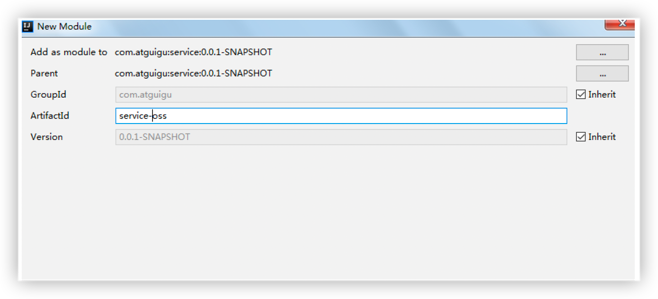
2. 配置 pom.xml

service-oss上级模块service已经引入service的公共依赖，所以service-oss模块只需引入阿里云oss相关依赖即可， service父模块已经引入了service-base模块，所以Swagger相关默认已经引入

```xml

<dependencies>
    <!-- 阿里云oss依赖 -->
    <dependency>
        <groupId>com.aliyun.oss</groupId>
        <artifactId>aliyun-sdk-oss</artifactId>
    </dependency>

    <!-- 日期工具栏依赖 -->
    <dependency>
        <groupId>joda-time</groupId>
        <artifactId>joda-time</artifactId>
    </dependency>
</dependencies>
```

3. 配置 application.properties

```shell
#服务端口
server.port=8002
#服务名
spring.application.name=service-oss

#环境设置：dev、test、prod
spring.profiles.active=dev
#阿里云 OSS

#不同的服务器，地址不同
aliyun.oss.file.endpoint=your endpoint
aliyun.oss.file.keyid=your accessKeyId
aliyun.oss.file.keysecret=your accessKeySecret
#bucket可以在控制台创建，也可以使用java代码创建
aliyun.oss.file.bucketname=guli-file
```

4. logback-spring.xml
5. 创建启动类`OssApplication.java`

```java
package com.guli.oss;

@SpringBootApplication
@ComponentScan({"com.atguigu"})
public class OssApplication {
    public static void main(String[] args) {
        SpringApplication.run(OssApplication.class, args);
    }
}
```

6. 启动项目

```text
spring boot 会默认加载org.springframework.boot.autoconfigure.jdbc.DataSourceAutoConfiguration这个
类，而DataSourceAutoConfiguration类使用了@Configuration注解向spring注入了dataSource bean，又因为
项目（oss模块）中并没有关于dataSource相关的配置信息，所以当spring创建dataSource bean时因缺
少相关的信息就会报错。
```

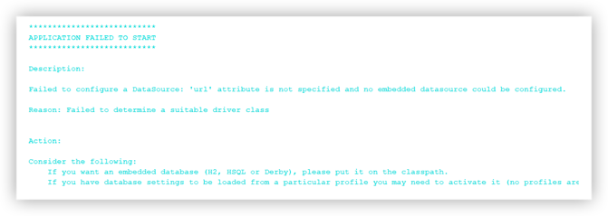
解决办法： 在@SpringBootApplication注解上加上exclude，解除自动加载DataSourceAutoConfiguration
`@SpringBootApplication(exclude = DataSourceAutoConfiguration.class)`

### 4、实现文件上传

1. 从配置文件读取常量
    - 创建常量读取工具类：ConstantPropertiesUtil.java
    - 使用@Value读取application.properties里的配置内容
    - 用spring的 InitializingBean 的 afterPropertiesSet 来初始化配置信息，这个方法将在所有的属性被初始化 后调用。

```java
/**
 * 常量类，读取配置文件application.properties中的配置
 * implements InitializingBean： 当项目一启动 spring 接口，Spring 加载之后，执行接口当一个方法
 */
@Component
//@PropertySource("classpath:application.properties")
public class ConstantPropertiesUtil implements InitializingBean {
    @Value("${aliyun.oss.file.endpoint}")
    private String endpoint;

    @Value("${aliyun.oss.file.keyid}")
    private String keyId;

    @Value("${aliyun.oss.file.keysecret}")
    private String keySecret;

    @Value("${aliyun.oss.file.filehost}")
    private String fileHost;

    @Value("${aliyun.oss.file.bucketname}")
    private String bucketName;

    public static String END_POINT;
    public static String ACCESS_KEY_ID;
    public static String ACCESS_KEY_SECRET;
    public static String BUCKET_NAME;
    public static String FILE_HOST;

    //定义公开当静态常量，外面可以调用
    @Override
    public void afterPropertiesSet() throws Exception {
        END_POINT = endpoint;
        ACCESS_KEY_ID = keyId;
        ACCESS_KEY_SECRET = keySecret;
        BUCKET_NAME = bucketName;
        FILE_HOST = fileHost;
    }
}
```

2. 文件上传

创建Service接口：`OssService.java`

```java
public interface FileService {
    /**
     * 文件上传至阿里云
     * @param file
     * @return
     */
    String upload(MultipartFile file);
}
```

实现：`OssServiceImpl.java`
参考SDK中的：Java -> 上传文件 -> 简单上传 -> 流式上传 -> 上传文件流
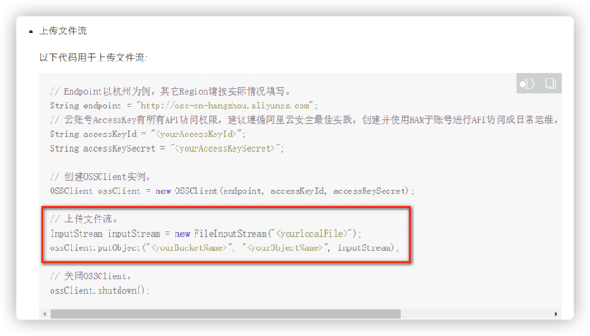

```java
public class OssServiceImpl implements OssService {

    //上传头像到 oss
    @Override
    public String upload(MultipartFile file) {
        //获取阿里云存储相关常量
        String endPoint = ConstantPropertiesUtil.END_POINT;
        String accessKeyId = ConstantPropertiesUtil.ACCESS_KEY_ID;
        String accessKeySecret = ConstantPropertiesUtil.ACCESS_KEY_SECRET;
        String bucketName = ConstantPropertiesUtil.BUCKET_NAME;
        String fileHost = ConstantPropertiesUtil.FILE_HOST;
        String uploadUrl = null;
        try {
            //判断oss实例是否存在：如果不存在则创建，如果存在则获取
            OSSClient ossClient = new OSSClient(endPoint, accessKeyId,
                    accessKeySecret);
            if (!ossClient.doesBucketExist(bucketName)) {
                //创建bucket
                ossClient.createBucket(bucketName);
                //设置oss实例的访问权限：公共读
                ossClient.setBucketAcl(bucketName, CannedAccessControlList.PublicRead);
            }
            //获取上传文件流
            InputStream inputStream = file.getInputStream();
            //构建日期路径：avatar/2019/02/26/文件名
            String filePath = new DateTime().toString("yyyy/MM/dd");
            //文件名：uuid.扩展名
            String original = file.getOriginalFilename();
            String fileName = UUID.randomUUID().toString();
            String fileType = original.substring(original.lastIndexOf("."));
            String newName = fileName + fileType;
            String fileUrl = fileHost + "/" + filePath + "/" + newName;
            //文件上传至阿里云
            //三个参数分别是 Bucket 名称，上传到 oss 文件路径和文件名称 //aa//bb//1.jpg，上传文件输入流
            ossClient.putObject(bucketName, fileUrl, inputStream);
            // 关闭OSSClient。
            ossClient.shutdown();
            //获取url地址
            uploadUrl = "http://" + bucketName + "." + endPoint + "/" + fileUrl;
        } catch (IOException e) {
            throw new GuliException(ResultCodeEnum.FILE_UPLOAD_ERROR);
        }
        return uploadUrl;
    }
}
```

3. 控制层 创建controller：`OssController.java`

```java
package com.guli.oss.controller;

@Api(description = "阿里云文件管理")
@CrossOrigin //跨域
@RestController
@RequestMapping("/admin/oss/file")
public class OssController {
    @Autowired
    private FileService fileService;

    /**
     * 文件上传
     *
     * @param file
     */
    @ApiOperation(value = "文件上传")
    @PostMapping("upload")
    public R upload(
            @ApiParam(name = "file", value = "文件", required = true)
            @RequestParam("file") MultipartFile file) {
        String uploadUrl = fileService.upload(file);
//返回r对象
        return R.ok().message("文件上传成功").data("url", uploadUrl);
    }
}
```

4. 重启oss服务
5. Swagger中测试文件上传
6. 配置nginx反向代理

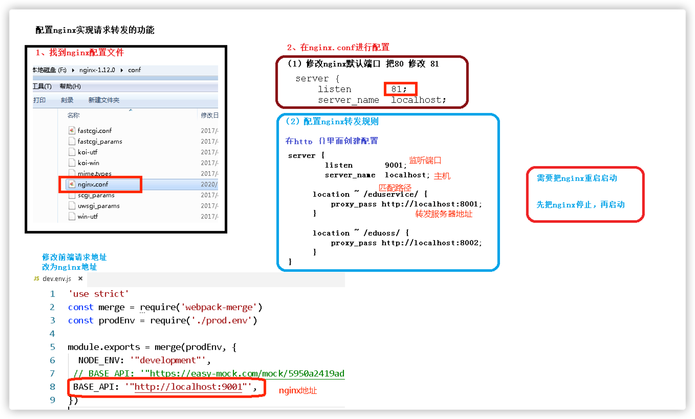
将接口地址加入nginx配置

```
location ~ /eduoss/ {
   proxy_pass http://localhost:8001;
}
```

7. 修改前端请求地址，改为 nginx 地址
   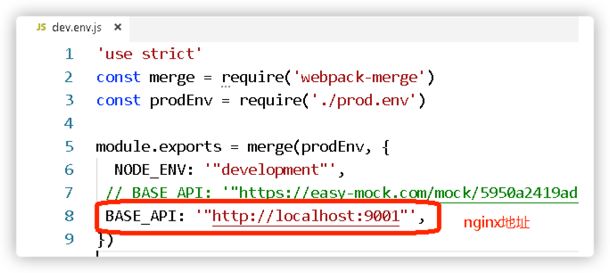

### 5、前端整合图片上传组件

1. 复制头像上传组件

从 vue-element-admin 复制组件：
`vue-element-admin/src/components/ImageCropper`
`vue-element-admin/src/components/PanThumb`

2. 前端参考实现

`src/views/components-demo/avatarUpload.vue`

4. 前端添加文件上传组件

`src/views/edu/teacher/form.vue`

```html
<!-- 讲师头像 -->
<el-form-item label="讲师头像">
    <!-- 头衔缩略图 -->
    <pan-thumb :image="teacher.avatar"/>
    <!-- 文件上传按钮 -->
    <el-button type="primary" icon="el-icon-upload"
               @click="imagecropperShow=true">更换头像
    </el-button>
    <!--
    v-show：是否显示上传组件
    :key：类似于id，如果一个页面多个图片上传控件，可以做区分
    :url：后台上传的url地址
    @close：关闭上传组件
    @crop-upload-success：上传成功后的回调 -->
    <image-cropper
            v-show="imagecropperShow"
            :width="300"
            :height="300"
            :key="imagecropperKey"
            :url="BASE_API+'/admin/oss/file/upload'"
            field="file"
            @close="close"
            @crop-upload-success="cropSuccess"/>
</el-form-item>
```

引入组件模块

```html
import ImageCropper from '@/components/ImageCropper'
import PanThumb from '@/components/PanThumb'
```

5. 设置默认头像

config/dev.env.js 中添加阿里云 oss bucket 地址 `OSS_PATH: '"https://guli-file.oss-cn-beijing.aliyuncs.com"'`
组件中初始化头像默认地址

```html
const defaultForm = {
......,
avatar: process.env.OSS_PATH + '/avatar/default.jpg'
}
```

6. js 脚本实现上传和图片回显

```javascript
export default {
    components: {ImageCropper, PanThumb},
    data() {
        return {
            //其它数据模型

            BASE_API: process.env.BASE_API, // 接口API地址
            imagecropperShow: false, // 是否显示上传组件
            imagecropperKey: 0 // 上传组件id
        }
    },


    methods: {
        //其他函数


        // 上传成功后的回调函数
        cropSuccess(data) {
            console.log(data)
            this.imagecropperShow = false
            this.teacher.avatar = data.url
            // 上传成功后，重新打开上传组件时初始化组件，否则显示上一次的上传结果
            this.imagecropperKey = this.imagecropperKey + 1
        },
        // 关闭上传组件
        close() {
            this.imagecropperShow = false
            // 上传失败后，重新打开上传组件时初始化组件，否则显示上一次的上传结果
            this.imagecropperKey = this.imagecropperKey + 1
        }
    }
}

```

# 十三、 EasyExcel

### 1、Excel导入导出的应用场景

1. 数据导入：减轻录入工作量
2. 数据导出：统计信息归档
3. 数据传输：异构系统之间数据传输

### 2、EasyExcel特点

- Java领域解析、生成Excel比较有名的框架有Apache poi、jxl等。但他们都存在一个严重的问题就是非常的耗内存。如果你的系统并发量不大的话可能还行，但是一旦并发上来后一定会 OOM 或者JVM频繁的full gc。
- EasyExcel是阿里巴巴开源的一个excel处理框架，以使用简单、节省内存著称。EasyExcel能大大减少占用内存的主要原因是在解析Excel时没有将文件数据一次性全部加载到内存中，而是从磁盘上一行行读取数据，逐个解析。
- EasyExcel采用一行一行的解析模式，并将一行的解析结果以观察者的模式通知处理 （AnalysisEventListener）。

### 3、创建项目，实现EasyExcel对Excel写操作

1. 创建一个普通的maven项目 `excel-easydemo`
2. pom 中引入xml相关依赖

```xml

<dependencies>
    <!-- https://mvnrepository.com/artifact/com.alibaba/easyexcel -->
    <dependency>
        <groupId>com.alibaba</groupId>
        <artifactId>easyexcel</artifactId>
        <version>2.1.1</version>
    </dependency>
</dependencies>
```

3. 创建实体类

设置表头和添加的数据字段

```java
import com.alibaba.excel.annotation.ExcelProperty;

//设置表头和添加的数据字段
public class DemoData {
    //设置表头名称
    @ExcelProperty("学生编号")
    private int sno;
    //设置表头名称
    @ExcelProperty("学生姓名")
    private String sname;

    public int getSno() {
        return sno;
    }

    public void setSno(int sno) {
        this.sno = sno;
    }

    public String getSname() {
        return sname;
    }

    public void setSname(String sname) {
        this.sname = sname;
    }

    @Override
    public String toString() {
        return "DemoData{" +
                "sno=" + sno +
                ", sname='" + sname + '\'' +
                '}';
    }
}
```

4. 实现写操作

创建方法循环设置要添加到Excel的数据

```text
//循环设置要添加的数据，最终封装到list集合中
private static List<DemoData> data() {
   List<DemoData> list = new ArrayList<DemoData>();
   for (int i = 0; i < 10; i++) {
      DemoData data = new DemoData();
      data.setSno(i);
      data.setSname("张三"+i);
      list.add(data);
   }
   return list;
}
```

实现最终的添加操作（写法一）

```text
public static void main(String[]args)throws Exception{
        // 写法1
        String fileName="F:\\11.xlsx";
        // 这里 需要指定写用哪个class去写，然后写到第一个sheet，名字为模板 然后文件流会自动关闭

        // 如果这里想使用03 则 传入excelType参数即可
        EasyExcel.write(fileName,DemoData.class).sheet("写入方法一").doWrite(data());
}
```

实现最终的添加操作（写法二）

```text
public static void main(String[]args)throws Exception{
        // 写法2，方法二需要手动关闭流
        String fileName="F:\\112.xlsx";
        // 这里 需要指定写用哪个class去写
        ExcelWriter excelWriter=EasyExcel.write(fileName,DemoData.class).build();
        WriteSheet writeSheet=EasyExcel.writerSheet("写入方法二").build();
        excelWriter.write(data(),writeSheet);
        // 千万别忘记finish 会帮忙关闭流
        excelWriter.finish();
}
```

### 4、实现EasyExcel对Excel读操作

1. 创建实体类

```java
import com.alibaba.excel.annotation.ExcelProperty;

public class ReadData {
    //设置列对应的属性
    @ExcelProperty(index = 0)
    private int sid;
    //设置列对应的属性
    @ExcelProperty(index = 1)
    private String sname;

    public int getSid() {
        return sid;
    }

    public void setSid(int sid) {
        this.sid = sid;
    }

    public String getSname() {
        return sname;
    }

    public void setSname(String sname) {
        this.sname = sname;
    }

    @Override
    public String toString() {
        return "ReadData{" +
                "sid=" + sid +
                ", sname='" + sname + '\'' +
                '}';
    }
}
```

2. 创建读取操作的监听器

```java
import com.alibaba.excel.context.AnalysisContext;
import com.alibaba.excel.event.AnalysisEventListener;
import com.alibaba.excel.exception.ExcelDataConvertException;
import com.sun.scenario.effect.impl.sw.sse.SSEBlend_SRC_OUTPeer;

import java.util.ArrayList;
import java.util.List;
import java.util.Map;

//创建读取excel监听器
public class ExcelListener extends AnalysisEventListener<ReadData> {
    //创建list集合封装最终的数据
    List<ReadData> list = new ArrayList<ReadData>();

    //一行一行去读取 excel 内容
    @Override
    public void invoke(ReadData user, AnalysisContext analysisContext) {
        System.out.println("***" + user);
        list.add(user);
    }

    //读取excel表头信息
    @Override
    public void invokeHeadMap(Map<Integer, String> headMap, AnalysisContext
            context) {
        System.out.println("表头信息：" + headMap);
    }

    //读取完成后执行
    @Override
    public void doAfterAllAnalysed(AnalysisContext analysisContext) {
    }
}
```

3. 调用实现最终的读取

```java
class Solution {
    public static void main(String[] args) throws Exception {
        // 写法1：
        String fileName = "F:\\01.xlsx";
        // 这里 需要指定读用哪个class去读，然后读取第一个sheet 文件流会自动关闭
        EasyExcel.read(fileName, ReadData.class, new
                ExcelListener()).sheet().doRead();
        // 写法2：
        InputStream in = new BufferedInputStream(new
                FileInputStream("F:\\01.xlsx"));
        ExcelReader excelReader = EasyExcel.read(in, ReadData.class, new
                ExcelListener()).build();
        ReadSheet readSheet = EasyExcel.readSheet(0).build();
        excelReader.read(readSheet);
        // 这里千万别忘记关闭，读的时候会创建临时文件，到时磁盘会崩的
        excelReader.finish();
    }
}
``` 

# 十四、课程管理

### 1、添加课程

1. service-edu 模块配置依赖

```xml

<dependencies>
    <!-- https://mvnrepository.com/artifact/com.alibaba/easyexcel -->
    <dependency>
        <groupId>com.alibaba</groupId>
        <artifactId>easyexcel</artifactId>
        <version>2.1.1</version>
    </dependency>
</dependencies>
```

2. SubjectAdminController

```java
package com.guli.edu.controller.admin;

@Api(description = "课程分类管理")
@CrossOrigin //跨域
@RestController
@RequestMapping("/eduservice/subject")
public class SubjectAdminController {
    @Autowired
    private SubjectService subjectService;

    //添加课程分类
    @ApiOperation(value = "Excel批量导入")
    @PostMapping("addSubject")
    public R addSubject(MultipartFile file) {
//1 获取上传的excel文件 MultipartFile
//返回错误提示信息
        subjectService.importSubjectData(file, subjectService);
//判断返回集合是否为空
        return R.ok();
    }
}
```

3. 创建和 Excel 对应的实体类

```java
import com.alibaba.excel.annotation.ExcelProperty;
import lombok.Data;

@Data
public class ExcelSubjectData {
    @ExcelProperty(index = 0)
    private string oneSubjectName;
    @ExcelProperty(index = 1)
    private String twoSubjectName;
}
```

4. SubjectService

接口 `void batchImport(MultipartFile file);`
实现类

```java
class Solution {
    //添加课程分类
//poi读取excel内容
    @Override
    public void importSubjectData(MultipartFile file, EduSubjectService subjectService) {
        try {
            //1 获取文件输入流
            InputStream inputStream = file.getInputStream();
            // 这里 需要指定读用哪个class去读，然后读取第一个sheet 文件流会自动关闭
            EasyExcel.read(inputStream, ExcelSubjectData.class, new SubjectExcelListener(subjectService)).sheet().doRead();
        } catch (Exception e) {
            e.printStackTrace();
            throw new GuliException(20002, "添加课程分类失败");
        }
    }
}
```

5. 创建读取 Excel 监听器

```java
import com.alibaba.excel.context.AnalysisContext;
import com.alibaba.excel.event.AnalysisEventListener;
import com.atguigu.eduservice.entity.EduSubject;
import com.atguigu.eduservice.entity.vo.ExcelSubjectData;
import com.atguigu.eduservice.service.EduSubjectService;
import com.atguigu.servicebase.handler.GuliException;
import com.baomidou.mybatisplus.core.conditions.query.QueryWrapper;

import java.util.ArrayList;
import java.util.List;
import java.util.Map;

public class SubjectExcelListener extends AnalysisEventListener<ExcelSubjectData> {
    //SubjectExcelListener 不能交给 spring 进行管理，需要自己 new ，不能注入其他对象
    //不能通过 serviceMapper 实现数据库操作
    public EduSubjectService subjectService;

    public SubjectExcelListener() {
    }

    //创建有参数构造，传递subjectService用于操作数据库
    public SubjectExcelListener(EduSubjectService subjectService) {
        this.subjectService = subjectService;
    }

    //一行一行去读取 excel 内容，每次读取有两个值，第一个值是一级分类，第二个值是二级分类
    @Override
    public void invoke(ExcelSubjectData user, AnalysisContext analysisContext) {
        if (user == null) {
            throw new GuliException(20001, "添加失败");
        }
        //添加一级分类
        EduSubject existOneSubject =
                this.existOneSubject(subjectService, user.getOneSubjectName());
        if (existOneSubject == null) {//没有相同的
            existOneSubject = new EduSubject();
            existOneSubject.setTitle(user.getOneSubjectName());
            existOneSubject.setParentId("0");
            subjectService.save(existOneSubject);
        }
        //获取一级分类id值
        String pid = existOneSubject.getId();
        //添加二级分类
        EduSubject existTwoSubject =
                this.existTwoSubject(subjectService, user.getTwoSubjectName(), pid);
        if (existTwoSubject == null) {
            existTwoSubject = new EduSubject();
            existTwoSubject.setTitle(user.getTwoSubjectName());
            existTwoSubject.setParentId(pid);
            subjectService.save(existTwoSubject);
        }
    }

    //读取excel表头信息
    @Override
    public void invokeHeadMap(Map<Integer, String> headMap, AnalysisContext
            context) {
        System.out.println("表头信息：" + headMap);
    }

    //读取完成后执行
    @Override
    public void doAfterAllAnalysed(AnalysisContext analysisContext) {
    }

    //判断一级分类是否重复
    private EduSubject existTwoSubject(EduSubjectService subjectService, String
            name, String pid) {
        QueryWrapper<EduSubject> wrapper = new QueryWrapper<>();
        wrapper.eq("title", name);
        wrapper.eq("parent_id", pid);
        EduSubject eduSubject = subjectService.getOne(wrapper);
        return eduSubject;
    }

    //判断一级分类是否重复
    private EduSubject existOneSubject(EduSubjectService subjectService, String
            name) {
        QueryWrapper<EduSubject> wrapper = new QueryWrapper<>();
        wrapper.eq("title", name);
        wrapper.eq("parent_id", "0");
        EduSubject eduSubject = subjectService.getOne(wrapper);
        return eduSubject;
    }
}
```

### 2、前端实现
1.


