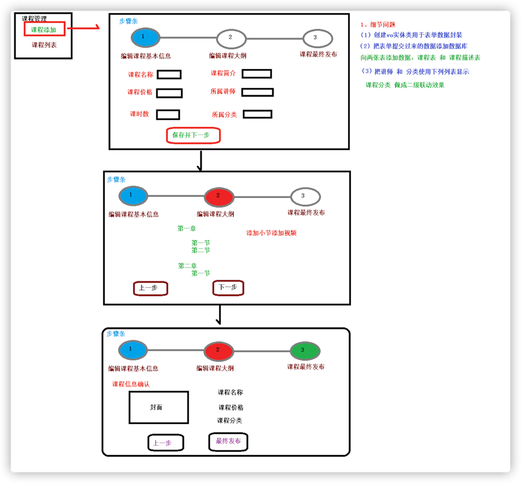

# 一、功能简介

谷粒学院，是一个B2C模式的职业技能在线教育系统，分为前台用户系统和后台运营平台。

# 二、系统模块


# 三、系统架构

架构设计需要考虑的几个方面：

- 性能：主要考虑访问频率，每个用户每天的访问次数。项目初始阶段用户的访问量并不大，如果考虑做运营推广，可能会迎来服务器访问量骤增，因此要考虑分布式部署，引入缓存
- 可扩展性：系统功能会随着用户量的增加以及多变的互联网用户需求不断地扩展，因此考虑到系统的可扩展性的要求需要使用微服务架构，引入消息中间件
-

高可用：系统一旦宕机，将会带来不可挽回的损失，因此必须做负载均衡，甚至是异地多活这类复杂的方案。如果数据丢失，修复将会非常麻烦，只能靠人工逐条修复，这个很难接受，因此需要考虑存储高可靠。我们需要考虑多种异常情况：机器故障、机房故障，针对机器故障，我们需要设计
MySQL 同机房主备方案；针对机房故障，我们需要设计 MySQL 跨机房同步方案。

- 安全性：系统的信息有一定的隐私性，例如用户的个人身份信息，不包含强隐私（例如玉照、情感）的信息，因此使用账号密码管理、数据库访问权限控制即可。
- 成本：视频类网站的主要成本在于服务器成本、流量成本、存储成本、流媒体研发成本，中小型公司可以考虑使用云服务器和云服务。
  

# 四、工程结构介绍


guli-parent：在线教学根目录（父工程），管理四个子模块：

- canal-client：canal数据库表同步模块（统计同步数据）
- common：公共模块父节点
    - common-util：工具类模块，所有模块都可以依赖于它
    - service-base：service服务的base包，包含service服务的公共配置类，所有service模块依赖于它
    - spring-security：认证与授权模块，需要认证授权的service服务依赖于它
- infrastructure：基础服务模块父节点
- api-gateway：api网关服务
- service：api接口服务父节点
    - service-acl：用户权限管理api接口服务（用户管理、角色管理和权限管理等）
    - service-cms：cms api接口服务
    - service-edu：教学相关api接口服务
    - service-msm：短信api接口服务
    - service-order：订单相关api接口服务
    - service-oss：阿里云oss api接口服务
    - service-statistics：统计报表api接口服务
    - service-ucenter：会员api接口服务
    - service-vod：视频点播api接口服务

# 五、各种模块

### 1. 讲师模块

#### 1.1 在 service 下面 service-edu 模块中创建配置文件

resources目录下创建文件 application.properties

```text
# 服务端口
server.port=8001
# 服务名
spring.application.name=service-edu
# 环境设置：dev、test、prod
spring.profiles.active=dev
# mysql数据库连接
spring.datasource.driver-class-name=com.mysql.cj.jdbc.Driver
spring.datasource.url=jdbc:mysql://localhost:3306/guli?serverTimezone=GMT%2B8
spring.datasource.username=root
spring.datasource.password=root
#mybatis日志
mybatis-plus.configuration.log-impl=org.apache.ibatis.logging.stdout.StdOutImpl
```

#### 1.2 创建MP代码生成器

```java
public class getCode {
    @Test
    public void main1() {
        // 1、创建代码生成器
        AutoGenerator mpg = new AutoGenerator();

        // 2、全局配置
        GlobalConfig gc = new GlobalConfig();
        String projectPath = System.getProperty("user.dir");
        //这里最好修改成绝对路径
        System.out.println(projectPath);
        gc.setOutputDir(projectPath + "/src/main/java");
        gc.setAuthor("aaenen");
        gc.setOpen(false); //生成后是否打开资源管理器
        gc.setFileOverride(false); //重新生成时文件是否覆盖
        /*
         * mp生成service层代码，默认接口名称第一个字母有 I
         * UcenterService
         * */
        gc.setServiceName("%sService"); //去掉Service接口的首字母I
        gc.setIdType(IdType.ID_WORKER); //主键策略
        gc.setDateType(DateType.ONLY_DATE);//定义生成的实体类中日期类型
        gc.setSwagger2(true);//开启Swagger2模式
        mpg.setGlobalConfig(gc);

        // 3、数据源配置
        DataSourceConfig dsc = new DataSourceConfig();
        dsc.setUrl("jdbc:mysql://localhost:3306/guli?serverTimezone=GMT%2B8");
        dsc.setDriverName("com.mysql.cj.jdbc.Driver");
        dsc.setUsername("root");
        dsc.setPassword("root");
        dsc.setDbType(DbType.MYSQL);
        mpg.setDataSource(dsc);

        // 4、包配置
        PackageConfig pc = new PackageConfig();
        pc.setParent("com.atguigu");
        pc.setModuleName("sduservice"); //模块名
        pc.setController("controller");
        pc.setEntity("entity");
        pc.setService("service");
        pc.setMapper("mapper");
        mpg.setPackageInfo(pc);

        // 5、策略配置
        StrategyConfig strategy = new StrategyConfig();
        strategy.setInclude("edu_teacher");
        strategy.setNaming(NamingStrategy.underline_to_camel);//数据库表映射到实体的
        命名策略
        strategy.setTablePrefix(pc.getModuleName() + "_"); //生成实体时去掉表前缀
        strategy.setColumnNaming(NamingStrategy.underline_to_camel);
        //数据库表字段映射到实体的命名策略
        strategy.setEntityLombokModel(true); // lombok 模型 @Accessors(chain = true)setter链式操作
        strategy.setRestControllerStyle(true); //restful api风格控制器
        strategy.setControllerMappingHyphenStyle(true); //url中驼峰转连字符
        mpg.setStrategy(strategy);

        // 6、执行
        mpg.execute();
    }
}
```

#### 1.3 讲师列表接口

- 创建 controller

```java

@RestController
@RequestMapping("/eduservice/teacher")
//@CrossOrigin
public class EduTeacherController {

    //访问地址： http://localhost:8001/eduservice/teacher/findAll
    //把service注入
    @Autowired
    private EduTeacherService teacherService;

    //1 查询讲师表所有数据
    //rest风格
    @ApiOperation(value = "所有讲师列表")
    @GetMapping("findAll")
    public R findAllTeacher() {
        //调用service的方法实现查询所有的操作
        List<EduTeacher> list = teacherService.list(null);
        return R.ok().data("items", list);
    }
}
```

- 创建启动类

```java

@SpringBootApplication
@EnableDiscoveryClient  //nacos注册
@EnableFeignClients
@ComponentScan(basePackages = {"com.atguigu"})
public class EduApplication {

    public static void main(String[] args) {
        SpringApplication.run(EduApplication.class, args);
    }
}

```

- 创建配置类，配置 mapper 扫描和其他

```java

@Configuration
@MapperScan("com.atguigu.eduservice.mapper")
public class EduConfig {
}
```

- 最终测试

```text
项目启动起来，使用端口 8001
Tomcat started on port (s) : 8001 (htto) with context path
Started EduApplication in 4.566 seconds (JVM running for 7.158)
```

#### 1.4 讲师逻辑删除功能

- 配置逻辑删除插件

```text
    // 在 config 中配置
    /**
     * 逻辑删除插件
     */
    @Bean
    public ISqlInjector sqlInjector() {
        return new LogicSqlInjector();
    }

```

- 逻辑删除属性上添加注解

```text
    //在 entity 实体类中，逻辑删除属性上添加 @TableLogic 注解
    @ApiModelProperty(value = "逻辑删除 1（true）已删除， 0（false）未删除")
    @TableLogic
    private Boolean isDeleted;
```

- 编写 controller 里面的方法

```text
    //2 逻辑删除讲师的方法
    @ApiOperation(value = "逻辑删除讲师")
    // id 值需要通过路径进行传递
    @DeleteMapping("{id}")
    // @PathVariable String id 获取路径的 id 值
    public R removeTeacher(@ApiParam(name = "id", value = "讲师ID", required = true) @PathVariable String id){
        boolean flag = teacherService.removeById(id);
        if(flag){
            return R.ok();
        }else{
            return R.error();
        }
    }
```

- swagger 测试

### 2. 课程分类模块

##### 2.1 前端实现

1. 参考 views/tree/index.vue
2. 创建 api `api/edu/subject.js`

```javascript
import request from '@/utils/request'

const api_name = '/admin/edu/subject'
export default {
    getNestedTreeList() {
        return request({
            url: `${api_name}`,
            method: 'get'
        })
    }
}
```

3. list.vue

```html

<template>
    <div class="app-container">
        <el-input v-model="filterText" placeholder="Filter keyword" style="margin-bottom:30px;"
        />
        <el-tree
                ref="subjectTree"
                :data="subjectList"
                :props="defaultProps"
                :filter-node-method="filterNode"
                class="filter-tree"
                default-expand-all
        />
    </div>
</template>
<script>
    import subject from '@/api/edu/subject'

    export default {
        data() {
            return {
                filterText: '',
                subjectList: [],
                defaultProps: {
                    children: 'children',
                    label: 'title'
                }
            }
        },
        watch: {
            filterText(val) {
                this.$refs.subjectTree.filter(val)
            }
        },
        created() {
            this.fetchNodeList()
        },
        methods: {
            fetchNodeList() {
                subject.getNestedTreeList().then(response => {
                    if (response.success === true) {
                        this.subjectList = response.data.items
                    }
                })
            },
            filterNode(value, data) {
                if (!value) return true
                return data.title.indexOf(value) !== -1
            }
        }
    }
</script>
```

2.4 原始数据格式

```javascript
data: [{
    label: '一级 1',
    children: [{
        label: '二级 1-1',
        children: [{
            label: '三级 1-1-1'
        }]
    }]
}, {
    label: '一级 2',
    children: [{
        label: '二级 2-1',
        children: [{
            label: '三级 2-1-1'
        }]
    }, {
        label: '二级 2-2',
        children: [{
            label: '三级 2-2-1'
        }]
    }]
}, {
    label: '一级 3',
    children: [{
        label: '二级 3-1',
        children: [{
            label: '三级 3-1-1'
        }]
    }, {
        label: '二级 3-2',
        children: [{
            label: '三级 3-2-1'
        }]
    }]
}]
```

##### 2. 后端实现

1. 创建 vo(entiy 实体类)

```java
package com.guli.edu.vo;

@Data
public class SubjectNestedVo {
    private String id;
    private String title;
    //用一个 list 来放二级分类
    private List<SubjectVo> children = new ArrayList<>();
}
```

```java
package com.guli.edu.vo;

@Data
public class TwoSubjectVo {
    private String id;
    private String title;
}
```

2. 创建controller

```java
class controller {
    @ApiOperation(value = "嵌套数据列表")
    @GetMapping("")
    public R nestedList() {
        List<SubjectNestedVo> subjectNestedVoList = subjectService.nestedList();
        return R.ok().data("items", subjectNestedVoList);
    }
}
```

3. 创建service

```java
class serviceImp {
    @Override
    public List<SubjectNestedVo> nestedList() {
        //最终要的到的数据列表
        ArrayList<SubjectNestedVo> subjectNestedVoArrayList = new ArrayList<>();
        //获取一级分类数据记录
        QueryWrapper<Subject> queryWrapper = new QueryWrapper<>();
        queryWrapper.eq("parent_id", 0);
        queryWrapper.orderByAsc("sort", "id");
        List<Subject> subjects = baseMapper.selectList(queryWrapper);
        //获取二级分类数据记录
        QueryWrapper<Subject> queryWrapper2 = new QueryWrapper<>();
        queryWrapper2.ne("parent_id", 0);
        queryWrapper2.orderByAsc("sort", "id");
        List<Subject> subSubjects = baseMapper.selectList(queryWrapper2);
        //填充一级分类vo数据
        int count = subjects.size();
        for (int i = 0; i < count; i++) {
            Subject subject = subjects.get(i);
            //创建一级类别vo对象
            SubjectNestedVo subjectNestedVo = new SubjectNestedVo();
            BeanUtils.copyProperties(subject, subjectNestedVo);
            subjectNestedVoArrayList.add(subjectNestedVo);
            //填充二级分类vo数据
            ArrayList<SubjectVo> subjectVoArrayList = new ArrayList<>();
            int count2 = subSubjects.size();
            for (int j = 0; j < count2; j++) {
                Subject subSubject = subSubjects.get(j);
                if (subject.getId().equals(subSubject.getParentId())) {
                    //创建二级类别vo对象
                    SubjectVo subjectVo = new SubjectVo();
                    BeanUtils.copyProperties(subSubject, subjectVo);
                    subjectVoArrayList.add(subjectVo);
                }
            }
            subjectNestedVo.setChildren(subjectVoArrayList);
        }
        return subjectNestedVoArrayList;
    }
}
```

##### 2.3 优化前端过滤功能

```javascript
filterNode(value, data)
{
    if (!value) return true
    return data.title.toLowerCase().indexOf(value.toLowerCase()) !== -1
}
```

#### 3. 课程发布模块

##### 3.1 课程发布流程

分为三步，每一步会保存一次


##### 3.2 课程中的数据表关系


##### 3.

##### 3.

# 六、Swagger 测试

### 1. Swagger2 介绍

前后端分离开发模式中，api文档是最好的沟通方式。

Swagger 是一个规范和完整的框架，用于生成、描述、调用和可视化 RESTful 风格的 Web 服务。

- 及时性 (接口变更后，能够及时准确地通知相关前后端开发人员)
- 规范性 (并且保证接口的规范性，如接口的地址，请求方式，参数及响应格式和错误信息)
- 一致性 (接口信息一致，不会出现因开发人员拿到的文档版本不一致，而出现分歧)
- 可测性 (直接在接口文档上进行测试，以方便理解业务)

### 2. 配置 Swagger2

2.1 创建common模块，在 guli-parent 下创建模块 common

配置：

- groupId：com.atguigu
- artifactId：common

2.2 在 common中 引入相关依赖 pom.xml

```xml
<?xml version="1.0"encoding="UTF-8"?>
<project xmlns="http://maven.apache.org/POM/4.0.0"
         xmlns:xsi="http://www.w3.org/2001/XMLSchema-instance"
         xsi:schemaLocation="http://maven.apache.org/POM/4.0.0 http://maven.apache.org/xsd/maven-4.0.0.xsd">
    <parent>
        <artifactId>guli_parent</artifactId>
        <groupId>com.atguigu</groupId>
        <version>0.0.1-SNAPSHOT</version>
    </parent>
    <modelVersion>4.0.0</modelVersion>

    <artifactId>common</artifactId>
    <packaging>pom</packaging>
    <modules>
        <module>service_base</module>
        <module>common_utils</module>
        <module>spring_security</module>
    </modules>

    <dependencies>
        <dependency>
            <groupId>org.springframework.boot</groupId>
            <artifactId>spring-boot-starter-web</artifactId>
            <scope>provided</scope>
        </dependency>

        <!--mybatis-plus-->
        <dependency>
            <groupId>com.baomidou</groupId>
            <artifactId>mybatis-plus-boot-starter</artifactId>
            <scope>provided</scope>
        </dependency>

        <!--lombok用来简化实体类：需要安装lombok插件-->
        <dependency>
            <groupId>org.projectlombok</groupId>
            <artifactId>lombok</artifactId>
            <scope>provided</scope>
        </dependency>

        <!--swagger-->
        <dependency>
            <groupId>io.springfox</groupId>
            <artifactId>springfox-swagger2</artifactId>
            <scope>provided</scope>
        </dependency>
        <dependency>
            <groupId>io.springfox</groupId>
            <artifactId>springfox-swagger-ui</artifactId>
            <scope>provided</scope>
        </dependency>

        <!--redis-->
        <dependency>
            <groupId>org.springframework.boot</groupId>
            <artifactId>spring-boot-starter-data-redis</artifactId>
        </dependency>

        <!--spring2.X集成redis所需common-pool2-->
        <dependency>
            <groupId>org.apache.commons</groupId>
            <artifactId>commons-pool2</artifactId>
            <version>2.6.0</version>
        </dependency>
    </dependencies>
</project>
```

2.3 在common下面创建子模块service-base

2.4 在模块service-base中，创建swagger的配置类

```java
package com.atguigu.servicebase;

import com.google.common.base.Predicates;
import org.springframework.context.annotation.Bean;
import org.springframework.context.annotation.Configuration;
import springfox.documentation.builders.ApiInfoBuilder;
import springfox.documentation.builders.PathSelectors;
import springfox.documentation.service.ApiInfo;
import springfox.documentation.service.Contact;
import springfox.documentation.spi.DocumentationType;
import springfox.documentation.spring.web.plugins.Docket;
import springfox.documentation.swagger2.annotations.EnableSwagger2;

@Configuration//配置类
@EnableSwagger2 //swagger注解
public class SwaggerConfig {

    @Bean
    public Docket webApiConfig() {
        return new Docket(DocumentationType.SWAGGER_2)
                .groupName("webApi")
                .apiInfo(webApiInfo())
                .select()
                //.paths(Predicates.not(PathSelectors.regex("/admin/.*")))
                .paths(Predicates.not(PathSelectors.regex("/error.*")))
                .build();

    }

    private ApiInfo webApiInfo() {

        return new ApiInfoBuilder()
                .title("网站-课程中心API文档")
                .description("本文档描述了课程中心微服务接口定义")
                .version("1.0")
                .contact(new Contact("java", "http://atguigu.com", "1123@qq.com"))
                .build();
    }
}
```

2.5 在模块service模块中引入service-base

```text
<dependency>
    <groupId>com.atguigu</groupId>
    <artifactId>service-base</artifactId>
    <version>0.0.1-SNAPSHOT</version>
</dependency>
```

2.6 在service-edu启动类上添加注解，进行测试


2.7 访问 swagger


# 七、定义接口说明和参数说明

- 定义在类上：@Api
- 定义在方法上：@ApiOperation
- 定义在参数上：@ApiParam

```java

@Api(description = "讲师管理")
@RestController
@RequestMapping("/admin/edu/teacher")
public class TeacherAdminController {
    @Autowired
    private TeacherService teacherService;

    @ApiOperation(value = "所有讲师列表")
    @GetMapping
    public List<Teacher> list() {
        return teacherService.list(null);
    }

    @ApiOperation(value = "根据ID删除讲师")
    @DeleteMapping("{id}")
    public boolean removeById(
            @ApiParam(name = "id", value = "讲师ID", required = true)
            @PathVariable String id) {
        return teacherService.removeById(id);
    }
}
```

# 八、统一返回数据格式

```text
项目中我们会将响应封装成json返回，一般我们会将所有接口的数据格式统一， 使前端(iOS Android Web)对数据的操作更一致、轻松。
一般情况下，统一返回数据格式没有固定的格式，只要能描述清楚返回的数据状态以及要返回的具体数据就可以。但是一般会包含状态码、返回消息、数据这几部分内容
```

### 1. 创建统一结果返回类

1.1 在 common 模块下创建子模块 common-utils

1.2 创建接口定义返回码

```java
//创建包 com.atguigu.commonutils，创建接口 ResultCode.java
package com.atguigu.commonutils;

public interface ResultCode {
    public static Integer SUCCESS = 20000;
    public static Integer ERROR = 20001;
}
```

1.3 创建结果类 R.java

```java

//统一返回结果的类
@Data
public class R {

    @ApiModelProperty(value = "是否成功")
    private Boolean success;

    @ApiModelProperty(value = "返回码")
    private Integer code;

    @ApiModelProperty(value = "返回消息")
    private String message;

    @ApiModelProperty(value = "返回数据")
    private Map<String, Object> data = new HashMap<String, Object>();

    //把构造方法私有
    private R() {
    }

    //成功静态方法
    public static R ok() {
        R r = new R();
        r.setSuccess(true);
        r.setCode(ResultCode.SUCCESS);
        r.setMessage("成功");
        return r;
    }

    //失败静态方法
    public static R error() {
        R r = new R();
        r.setSuccess(false);
        r.setCode(ResultCode.ERROR);
        r.setMessage("失败");
        return r;
    }

    //链式编程
    public R success(Boolean success) {
        this.setSuccess(success);
        return this;
    }

    public R message(String message) {
        this.setMessage(message);
        return this;
    }

    public R code(Integer code) {
        this.setCode(code);
        return this;
    }

    public R data(String key, Object value) {
        this.data.put(key, value);
        return this;
    }

    public R data(Map<String, Object> map) {
        this.setData(map);
        return this;
    }
}
```

1.4 统一返回结果使用

- 在 service 模块中添加依赖 common_utils

```xml

<dependency>
    <groupId>com.atguigu</groupId>
    <artifactId>common_utils</artifactId>
    <version>0.0.1-SNAPSHOT</version>
</dependency>
```

- 修改Controller中的返回结果

```text
//列表
@ApiOperation(value = "所有讲师列表")
@GetMapping
public R list(){
        List<Teacher> list=teacherService.list(null);
        return R.ok().data("items",list);
}
```

```text
//删除
@ApiOperation(value = "根据ID删除讲师")
@DeleteMapping("{id}")
public R removeById(
    @ApiParam(name = "id", value = "讲师ID", required = true)
    @PathVariable String id){
        teacherService.removeById(id);
        return R.ok();
}
```

# 八、分页功能

1. MyBatisPlusConfig中配置分页插件

```text
/**
 * 分页插件
 */
@Bean
public PaginationInterceptor paginationInterceptor(){
        return new PaginationInterceptor();
}
```

2. 分页Controller方法 TeacherAdminController中添加分页方法

```text
@ApiOperation(value = "分页讲师列表")
@GetMapping("{page}/{limit}")
public R pageList(
    @ApiParam(name = "page", value = "当前页码", required = true)
    @PathVariable Long page,
    @ApiParam(name = "limit", value = "每页记录数", required = true)
    @PathVariable Long limit){
        //创建 page 对象
        Page<Teacher> pageParam=new Page<>(page,limit);
        //调用 service 中的方法
        teacherService.page(pageParam,null);
        //数据 list 集合
        List<Teacher> records=pageParam.getRecords();
        //总记录数
        long total=pageParam.getTotal();
        return R.ok().data("total",total).data("rows",records);
}
```

# 九、条件查询

1. 创建查询对象 创建 com.guli.edu.query 包，创建 TeacherQuery.java 查询对象

```java
package com.guli.edu.query;

@ApiModel(value = "Teacher查询对象", description = "讲师查询对象封装")
@Data
public class TeacherQuery implements Serializable {
    private static final long serialVersionUID = 1L;
    @ApiModelProperty(value = "教师名称,模糊查询")
    private String name;
    @ApiModelProperty(value = "头衔 1高级讲师 2首席讲师")
    private Integer level;
    @ApiModelProperty(value = "查询开始时间", example = "2019-01-01 10:10:10")
    private String begin;//注意，这里使用的是String类型，前端传过来的数据无需进行类型转换
    @ApiModelProperty(value = "查询结束时间", example = "2019-12-01 10:10:10")
    private String end;
}
```

2. service

- 接口

```java
package com.guli.edu.service;

public interface TeacherService extends IService<Teacher> {
    void pageQuery(Page<Teacher> pageParam, TeacherQuery teacherQuery);
}
```

- 实现

```java
 package com.guli.edu.service.impl;

@Service
public class TeacherServiceImpl extends ServiceImpl<TeacherMapper, Teacher>
        implements TeacherService {
    @Override
    public void pageQuery(Page<Teacher> pageParam, TeacherQuery teacherQuery) {
        QueryWrapper<Teacher> queryWrapper = new QueryWrapper<>();
        queryWrapper.orderByAsc("sort");
        if (teacherQuery == null) {
            baseMapper.selectPage(pageParam, queryWrapper);
            return;
        }
        //动态sql
        String name = teacherQuery.getName();
        Integer level = teacherQuery.getLevel();
        String begin = teacherQuery.getBegin();
        String end = teacherQuery.getEnd();
        if (!StringUtils.isEmpty(name)) {
            queryWrapper.like("name", name);
        }
        if (!StringUtils.isEmpty(level)) {
            queryWrapper.eq("level", level);
        }
        if (!StringUtils.isEmpty(begin)) {
            // ge 大于
            queryWrapper.ge("gmt_create", begin);
        }
        if (!StringUtils.isEmpty(end)) {
            // le 小于
            queryWrapper.le("gmt_create", end);
        }
        baseMapper.selectPage(pageParam, queryWrapper);
    }
}
```

3. controller

TeacherAdminController中修改 pageList方法：

增加参数TeacherQuery teacherQuery，非必选

```text 
@ApiOperation(value = "分页讲师列表")
@GetMapping("{page}/{limit}")
public R pageQuery(
  @ApiParam(name = "page", value = "当前页码", required = true)
  @PathVariable Long page,
  @ApiParam(name = "limit", value = "每页记录数", required = true)
  @PathVariable Long limit,
  @ApiParam(name = "teacherQuery", value = "查询对象", required = false)
  TeacherQuery teacherQuery){
        Page<Teacher> pageParam=new Page<>(page,limit);
        teacherService.pageQuery(pageParam,teacherQuery);
        List<Teacher> records=pageParam.getRecords();
        long total=pageParam.getTotal();
        return R.ok().data("total",total).data("rows",records);
        }
```

4. 根据条件值进行判断，拼接条件

- RequestBody 需要使用 post 提交方式，使用 json 传递数据，把 json 数据封装到对应对象里面
- RequestBody 返回数据，返回 json 数据
- @RequestBody（required = false） TeacherQuery teacherQuery 参数值可以为空

# 十、自动填充封装

1. 在 service-base 模块中添加

创建包handler，创建自动填充类 MyMetaObjectHandler

```java
package com.atguigu.servicebase.handler;

import com.baomidou.mybatisplus.core.handlers.MetaObjectHandler;
import org.apache.ibatis.reflection.MetaObject;
import org.springframework.stereotype.Component;

import java.util.Date;

@Component
public class MyMetaObjectHandler implements MetaObjectHandler {
    @Override
    public void insertFill(MetaObject metaObject) {
        //属性名称，不是字段名称
        this.setFieldValByName("gmtCreate", new Date(), metaObject);
        this.setFieldValByName("gmtModified", new Date(), metaObject);
    }

    @Override
    public void updateFill(MetaObject metaObject) {
        this.setFieldValByName("gmtModified", new Date(), metaObject);
    }
}

```

2. 在实体类添加自动填充注解
   
3. controller方法定义

- 添加讲师

```text
@ApiOperation(value = "新增讲师")
@PostMapping public R save(
    @ApiParam(name = "teacher", value = "讲师对象", required = true)
    @RequestBody Teacher teacher){ 
        teacherService.save(teacher); 
        return R.ok(); 
}
```

- 根据 id 查询

```text
@ApiOperation(value = "根据ID查询讲师")
@GetMapping("{id}")
public R getById(
    @ApiParam(name = "id", value = "讲师ID", required = true)
    @PathVariable String id){
        Teacher teacher = teacherService.getById(id);
        return R.ok().data("item", teacher);
} 
```

- 根据 id 修改

```text
@ApiOperation(value = "根据ID修改讲师")
@PutMapping("{id}")
public R updateById(
    @ApiParam(name = "id", value = "讲师ID", required = true)
    @PathVariable String id,
    @ApiParam(name = "teacher", value = "讲师对象", required = true)
    @RequestBody Teacher teacher){
        teacher.setId(id);
        teacherService.updateById(teacher);
        return R.ok();
}
```

# 十一、异常处理

1. 创建统一异常处理器

在service-base中创建统一异常处理类GlobalExceptionHandler.java：

```java
/**
 * 统一异常处理类
 */
@ControllerAdvice
public class GlobalExceptionHandler {

    //指定出现什么异常执行这个方法
    @ExceptionHandler(Exception.class)
    @ResponseBody   //为了返回数据
    public R error(Exception e) {
        e.printStackTrace();
        return R.error();
    }
}
```

2. 处理特定异常

GlobalExceptionHandler.java中添加

```text
@ExceptionHandler(ArithmeticException.class)
@ResponseBody
public R error(ArithmeticException e){
        e.printStackTrace();
        return R.error().message("执行了自定义异常");
}
```

3. 自定义异常

- 创建自定义异常类

```java
package com.atguigu.servicebase.exceptionhandler;

import lombok.AllArgsConstructor;
import lombok.Data;
import lombok.NoArgsConstructor;

@Data
@AllArgsConstructor  //生成有参数构造方法
@NoArgsConstructor   //生成无参数构造
public class GuliException extends RuntimeException {
    private Integer code;//状态码
    private String msg;//异常信息
}

```

- 业务中需要的位置抛出 GuliException

```text
try{
    int a=10/0;
}catch(Exception e){
    throw new GuliException(20001,"出现自定义异常");
}
```

- 添加异常处理方法
- GlobalExceptionHandler.java中添加

```text
    //自定义异常
    @ExceptionHandler(GuliException.class)
    @ResponseBody //为了返回数据
    public R error(GuliException e) {
        log.error(e.getMessage());
        e.printStackTrace();

        return R.error().code(e.getCode()).message(e.getMsg());
    }
```

4. 配置日志级别

日志记录器（Logger）的行为是分等级的。分为：OFF、FATAL、ERROR、WARN、INFO、DEBUG、ALL

默认情况下，spring boot从控制台打印出来的日志级别只有INFO及以上级别，可以配置日志级别
`# 设置日志级别 logging.level.root=WARN`
这种方式只能将日志打印在控制台上

5. Logback 日志

```text
spring boot内部使用Logback作为日志实现的框架。
Logback和log4j非常相似，如果你对log4j很熟悉，那对logback很快就会得心应手。
logback相对于log4j的一些优点：https://blog.csdn.net/caisini_vc/article/details/48551287
```

6. 配置 logback 日志

- 删除application.properties中的日志配置
- 安装idea彩色日志插件：grep-console
- resources 中创建 logback-spring.xml

```xml
<?xml version="1.0" encoding="UTF-8"?>
<configuration scan="true" scanPeriod="10 seconds">
    <!-- 日志级别从低到高分为TRACE < DEBUG < INFO < WARN < ERROR < FATAL，如果设置为WARN，则低于WARN的信息都不会输出 -->
    <!-- scan:当此属性设置为true时，配置文件如果发生改变，将会被重新加载，默认值为true -->
    <!-- scanPeriod:设置监测配置文件是否有修改的时间间隔，如果没有给出时间单位，默认单位是毫秒。当scan为true时，此属性生效。默认的时间间隔为1分钟。 -->
    <!-- debug:当此属性设置为true时，将打印出logback内部日志信息，实时查看logback运行状态。默认值为false。 -->

    <contextName>logback</contextName>
    <!-- name的值是变量的名称，value的值时变量定义的值。通过定义的值会被插入到logger上下文中。定义变量后，可以使“${}”来使用变量。 -->
    <property name="log.path" value="D:/guli_1010/edu"/>

    <!-- 彩色日志 -->
    <!-- 配置格式变量：CONSOLE_LOG_PATTERN 彩色日志格式 -->
    <!-- magenta:洋红 -->
    <!-- boldMagenta:粗红-->
    <!-- cyan:青色 -->
    <!-- white:白色 -->
    <!-- magenta:洋红 -->
    <property name="CONSOLE_LOG_PATTERN"
              value="%yellow(%date{yyyy-MM-dd HH:mm:ss}) |%highlight(%-5level) |%blue(%thread) |%blue(%file:%line) |%green(%logger) |%cyan(%msg%n)"/>


    <!--输出到控制台-->
    <appender name="CONSOLE" class="ch.qos.logback.core.ConsoleAppender">
        <!--此日志appender是为开发使用，只配置最底级别，控制台输出的日志级别是大于或等于此级别的日志信息-->
        <!-- 例如：如果此处配置了INFO级别，则后面其他位置即使配置了DEBUG级别的日志，也不会被输出 -->
        <filter class="ch.qos.logback.classic.filter.ThresholdFilter">
            <level>INFO</level>
        </filter>
        <encoder>
            <Pattern>${CONSOLE_LOG_PATTERN}</Pattern>
            <!-- 设置字符集 -->
            <charset>UTF-8</charset>
        </encoder>
    </appender>


    <!--输出到文件-->

    <!-- 时间滚动输出 level为 INFO 日志 -->
    <appender name="INFO_FILE" class="ch.qos.logback.core.rolling.RollingFileAppender">
        <!-- 正在记录的日志文件的路径及文件名 -->
        <file>${log.path}/log_info.log</file>
        <!--日志文件输出格式-->
        <encoder>
            <pattern>%d{yyyy-MM-dd HH:mm:ss.SSS} [%thread] %-5level %logger{50} - %msg%n</pattern>
            <charset>UTF-8</charset>
        </encoder>
        <!-- 日志记录器的滚动策略，按日期，按大小记录 -->
        <rollingPolicy class="ch.qos.logback.core.rolling.TimeBasedRollingPolicy">
            <!-- 每天日志归档路径以及格式 -->
            <fileNamePattern>${log.path}/info/log-info-%d{yyyy-MM-dd}.%i.log</fileNamePattern>
            <timeBasedFileNamingAndTriggeringPolicy class="ch.qos.logback.core.rolling.SizeAndTimeBasedFNATP">
                <maxFileSize>100MB</maxFileSize>
            </timeBasedFileNamingAndTriggeringPolicy>
            <!--日志文件保留天数-->
            <maxHistory>15</maxHistory>
        </rollingPolicy>
        <!-- 此日志文件只记录info级别的 -->
        <filter class="ch.qos.logback.classic.filter.LevelFilter">
            <level>INFO</level>
            <onMatch>ACCEPT</onMatch>
            <onMismatch>DENY</onMismatch>
        </filter>
    </appender>

    <!-- 时间滚动输出 level为 WARN 日志 -->
    <appender name="WARN_FILE" class="ch.qos.logback.core.rolling.RollingFileAppender">
        <!-- 正在记录的日志文件的路径及文件名 -->
        <file>${log.path}/log_warn.log</file>
        <!--日志文件输出格式-->
        <encoder>
            <pattern>%d{yyyy-MM-dd HH:mm:ss.SSS} [%thread] %-5level %logger{50} - %msg%n</pattern>
            <charset>UTF-8</charset> <!-- 此处设置字符集 -->
        </encoder>
        <!-- 日志记录器的滚动策略，按日期，按大小记录 -->
        <rollingPolicy class="ch.qos.logback.core.rolling.TimeBasedRollingPolicy">
            <fileNamePattern>${log.path}/warn/log-warn-%d{yyyy-MM-dd}.%i.log</fileNamePattern>
            <timeBasedFileNamingAndTriggeringPolicy class="ch.qos.logback.core.rolling.SizeAndTimeBasedFNATP">
                <maxFileSize>100MB</maxFileSize>
            </timeBasedFileNamingAndTriggeringPolicy>
            <!--日志文件保留天数-->
            <maxHistory>15</maxHistory>
        </rollingPolicy>
        <!-- 此日志文件只记录warn级别的 -->
        <filter class="ch.qos.logback.classic.filter.LevelFilter">
            <level>warn</level>
            <onMatch>ACCEPT</onMatch>
            <onMismatch>DENY</onMismatch>
        </filter>
    </appender>


    <!-- 时间滚动输出 level为 ERROR 日志 -->
    <appender name="ERROR_FILE" class="ch.qos.logback.core.rolling.RollingFileAppender">
        <!-- 正在记录的日志文件的路径及文件名 -->
        <file>${log.path}/log_error.log</file>
        <!--日志文件输出格式-->
        <encoder>
            <pattern>%d{yyyy-MM-dd HH:mm:ss.SSS} [%thread] %-5level %logger{50} - %msg%n</pattern>
            <charset>UTF-8</charset> <!-- 此处设置字符集 -->
        </encoder>
        <!-- 日志记录器的滚动策略，按日期，按大小记录 -->
        <rollingPolicy class="ch.qos.logback.core.rolling.TimeBasedRollingPolicy">
            <fileNamePattern>${log.path}/error/log-error-%d{yyyy-MM-dd}.%i.log</fileNamePattern>
            <timeBasedFileNamingAndTriggeringPolicy class="ch.qos.logback.core.rolling.SizeAndTimeBasedFNATP">
                <maxFileSize>100MB</maxFileSize>
            </timeBasedFileNamingAndTriggeringPolicy>
            <!--日志文件保留天数-->
            <maxHistory>15</maxHistory>
        </rollingPolicy>
        <!-- 此日志文件只记录ERROR级别的 -->
        <filter class="ch.qos.logback.classic.filter.LevelFilter">
            <level>ERROR</level>
            <onMatch>ACCEPT</onMatch>
            <onMismatch>DENY</onMismatch>
        </filter>
    </appender>

    <!--
        <logger>用来设置某一个包或者具体的某一个类的日志打印级别、以及指定<appender>。
        <logger>仅有一个name属性，
        一个可选的level和一个可选的addtivity属性。
        name:用来指定受此logger约束的某一个包或者具体的某一个类。
        level:用来设置打印级别，大小写无关：TRACE, DEBUG, INFO, WARN, ERROR, ALL 和 OFF，
              如果未设置此属性，那么当前logger将会继承上级的级别。
    -->
    <!--
        使用mybatis的时候，sql语句是debug下才会打印，而这里我们只配置了info，所以想要查看sql语句的话，有以下两种操作：
        第一种把<root level="INFO">改成<root level="DEBUG">这样就会打印sql，不过这样日志那边会出现很多其他消息
        第二种就是单独给mapper下目录配置DEBUG模式，代码如下，这样配置sql语句会打印，其他还是正常DEBUG级别：
     -->
    <!--开发环境:打印控制台-->
    <springProfile name="dev">
        <!--可以输出项目中的debug日志，包括mybatis的sql日志-->
        <logger name="com.guli" level="INFO"/>

        <!--
            root节点是必选节点，用来指定最基础的日志输出级别，只有一个level属性
            level:用来设置打印级别，大小写无关：TRACE, DEBUG, INFO, WARN, ERROR, ALL 和 OFF，默认是DEBUG
            可以包含零个或多个appender元素。
        -->
        <root level="INFO">
            <appender-ref ref="CONSOLE"/>
            <appender-ref ref="INFO_FILE"/>
            <appender-ref ref="WARN_FILE"/>
            <appender-ref ref="ERROR_FILE"/>
        </root>
    </springProfile>


    <!--生产环境:输出到文件-->
    <springProfile name="pro">

        <root level="INFO">
            <appender-ref ref="CONSOLE"/>
            <appender-ref ref="DEBUG_FILE"/>
            <appender-ref ref="INFO_FILE"/>
            <appender-ref ref="ERROR_FILE"/>
            <appender-ref ref="WARN_FILE"/>
        </root>
    </springProfile>

</configuration>
```

7. 将错误日志输出到文件

GlobalExceptionHandler.java 中 类上添加注解 `@Slf4j` ， 异常输出加上语句 `log.error(e.getMessage());`

8. 将日志堆栈信息输出到文件

guli-framework-common 下创建 util 包，创建 ExceptionUtil.java 工具类

```java
package com.guli.common.util;

public class ExceptionUtil {
    public static String getMessage(Exception e) {
        StringWriter sw = null;
        PrintWriter pw = null;
        try {
            sw = new StringWriter();
            pw = new PrintWriter(sw);
// 将出错的栈信息输出到printWriter中
            e.printStackTrace(pw);
            pw.flush();
            sw.flush();
        } finally {
            if (sw != null) {
                try {
                    sw.close();
                } catch (IOException e1) {
                    e1.printStackTrace();
                }
            }
            if (pw != null) {
                pw.close();
            }
        }
        return sw.toString();
    }
}
```

调用`log.error(ExceptionUtil.getMessage(e));`
GuliException 中创建 toString 方法

```text
@Override
public String toString(){
    return"GuliException{"+
        "message="+this.getMessage()+
        ", code="+code+
        '}';
}
```

# 十三、Tinymce 可视化编辑器

参考
[https://panjiachen.gitee.io/vue-element-admin/#/components/tinymce](https://panjiachen.gitee.io/vue-element-admin/#/components/tinymce)
[https://panjiachen.gitee.io/vue-element-admin/#/example/create](https://panjiachen.gitee.io/vue-element-admin/#/example/create)

### 1、组件初始化

Tinymce 是一个传统 javascript 插件，默认不能用于 Vue.js 因此需要做一些特殊的整合步骤

1. 复制脚本库

将脚本库复制到项目的 static 目录下（在`vue-element-admin-master`的 static 路径下）

2. 配置html变量

在 `guli-admin/build/webpack.dev.conf.js` 中添加配置，使在 html 页面中可是使用这里定义的 BASE_URL变量

```javascript
new HtmlWebpackPlugin({
    ......,
    templateParameters: {
        BASE_URL: config.dev.assetsPublicPath + config.dev.assetsSubDirectory
    }
})
```

3. 引入js脚本

在 `guli-admin/index.html` 中引入js脚本，中文化
`<script src=<%= BASE_URL %>/tinymce4.7.5/tinymce.min.js></script>`
`<script src=<%= BASE_URL %>/tinymce4.7.5/langs/zh_CN.js></script>`

### 2、组件引入

为了让 Tinymce 能用于 Vue.js 项目，vue-element-admin-master 对 Tinymce 进行了封装，下面我们将它引入到我们的课程信息页面

1. 复制组件 `src/components/Tinymce`
2. 引入组件

课程信息组件中引入 Tinymce

```javascript
import Tinymce from '@/components/Tinymce'

export default {
    components: {Tinymce},
    ......
```

3. 组件模板

```html
<!-- 课程简介-->
<el-form-item label="课程简介">
    <tinymce :height="300" v-model="courseInfo.description"/>
</el-form-item>
```

4. 组件样式

在info.vue文件的最后添加如下代码，调整上传图片按钮的高度

```javascript
<style scoped>
    .tinymce-container {
    line - height: 29px;
}
</style>
```

5. 图片的base64编码

Tinymce中的图片上传功能直接存储的是图片的base64编码，因此无需图片服务器

# 十四、阿里云视频点播技术能力盘点

### 1、阿里云视频点播技术能力盘点

参考文章：[https://blog.csdn.net/qq_33857573/article/details/79564255](https://blog.csdn.net/qq_33857573/article/details/79564255)

视频点播（ApsaraVideo for VoD）是集音视频采集、编辑、上传、自动化转码处理、媒体资源管理、分发加速于一体的一站式音视频点播解决方案。


1. 应用场景音

    - 视频网站：无论是初创视频服务企业，还是已拥有海量视频资源，可定制化的点播服务帮助客户快速搭建拥有极致观看体验、安全可靠的视频点播应用。
    - 短视频：集音视频拍摄、特效编辑、本地转码、高速上传、自动化云端转码、媒体资源管理、分发加速、播放于一体的完整短视频解决方案。目前已帮助1000+APP快速实现手机短视频功能。
    - 直播转点播：将直播流同步录制为点播视频，用于回看。并支持媒资管理、媒体处理（转码及内容审核/智能首图等AI处理）、内容制作（云剪辑）、CDN分发加速等一系列操作。
    -
   在线教育：为在线教育客户提供简单易用、安全可靠的视频点播服务。可通过控制台/API等多种方式上传教学视频，强大的转码能力保证视频可以快速发布，覆盖全网的加速节点保证学生观看的流畅度。防盗链、视频加密等版权保护方案保护教学内容不被窃取。
   -
   视频生产制作：提供在线可视化剪辑平台及丰富的OpenAPI，帮助客户高效处理、制作视频内容。除基础的剪切拼接、混音、遮标、特效、合成等一系列功能外，依托云剪辑及点播一体化服务还可实现标准化、智能化剪辑生产，大大降低视频制作的槛，缩短制作时间，提升内容生产效率。
    - 内容审核：应用于短视频平台、传媒行业审核等场景，帮助客户从从语音、文字、视觉等多维度精准识别视频、封面、标题或评论的违禁内容进行AI智能审核与人工审核。

2. 功能介绍

   

### 2、开通视频点播云平台

1. *选择视频点播服务*

   产品->企业应用->视频云->视频点播

2. 开通视频点播

3. 选择按使用流量计费

4. 整体流程

   

    - 用户获取上传授权。
    - VoD下发 上传地址和凭证 及 VideoId。
    - 用户上传视频保存视频ID(VideoId)。
    - 用户服务端获取播放凭证。
    - VoD下发带时效的播放凭证。用户服务端将播放凭证下发给客户端完成视频播放。

### 3、视频点播服务的基本使用

完整的参考文档：[https://help.aliyun.com/product/29932.html?spm=a2c4g.11186623.6.540.3c356a58OEmVZJ](https://help.aliyun.com/product/29932.html?spm=a2c4g.11186623.6.540.3c356a58OEmVZJ)

1. *设置转码格式*

   选择全局设置 > 转码设置，单击添加转码模板组。

   在视频转码模板组页面，根据业务需求选择封装格式和清晰度。

   或直接将已有的模板设置为默认即可

2. 分类管理

   选择全局设置 > 分类管理

3. 上传视频文件

   选择媒资库 > 音视频，单击上传音视频

4. 配置域名

   音视频上传完成后，必须配一个已备案的域名，并完成CNAME绑定
   
   得到CNAME
   
   在购买域名的服务商处的管理控制台配置域名解析
   

5. 在控制台查看视频

   此时视频可以在阿里云控制台播放

6. 获取web播放器代码

   

### 4、服务端SDK

1. 简介

sdk的方式将api进行了进一步的封装，不用自己创建工具类。 我们可以基于服务端SDK编写代码来调用点播API，实现对点播产品和服务的快速操作。

3. 功能介绍
    - SDK封装了对API的调用请求和响应，避免自行计算较为繁琐的 API签名。
    - 支持所有点播服务的API，并提供了相应的示例代码。
    - 支持7种开发语言，包括：Java、Python、PHP、.NET、Node.js、Go、C/C++。
    - 通常在发布新的API后，我们会及时同步更新SDK，所以即便您没有找到对应API的示例代码，也可以参考旧的示例自行实现调用。

### 5、使用SDK


1. 安装

   参考文档：[https://help.aliyun.com/document_detail/57756.html](https://help.aliyun.com/document_detail/57756.html)
   添加maven仓库的配置和依赖到pom

```xml

<repositories>
    <repository>
        <id>sonatype-nexus-staging</id>
        <name>Sonatype Nexus Staging</name>
        <url>https://oss.sonatype.org/service/local/staging/deploy/maven2/</url>
        <releases>
            <enabled>true</enabled>
        </releases>
        <snapshots>
            <enabled>true</enabled>
        </snapshots>
    </repository>
</repositories>
```

```text
<dependency>
    <groupId>com.aliyun</groupId>
    <artifactId>aliyun-java-sdk-core</artifactId>
    <version>4.3.3</version>
</dependency>
<dependency>
    <groupId>com.aliyun</groupId>
    <artifactId>aliyun-java-sdk-vod</artifactId>
    <version>2.15.5</version>
</dependency>
<dependency>
    <groupId>com.google.code.gson</groupId>
    <artifactId>gson</artifactId>
    <version>2.8.2</version>
</dependency>
```

2. 初始化

   参考文档：[https://help.aliyun.com/document_detail/61062.html](https://help.aliyun.com/document_detail/61062.html)
   根据文档示例创建 AliyunVODSDKUtils.java

```java
package com.atguigu.aliyunvod.util;

public class AliyunVodSDKUtils {
    public static DefaultAcsClient initVodClient(String accessKeyId, String
            accessKeySecret) throws ClientException {
        String regionId = "cn-shanghai"; // 点播服务接入区域
        DefaultProfile profile = DefaultProfile.getProfile(regionId, accessKeyId,
                accessKeySecret);
        DefaultAcsClient client = new DefaultAcsClient(profile);
        return client;
    }
}
```

3. 创建测试类 `VodSdkTest.java`

```java
package com.atguigu.aliyunvod;

public class VodSdkTest {
    String accessKeyId = "你的accessKeyId";
    String accessKeySecret = "你的accessKeySecret";
}
```

### 6、创建测试用例

参考文档：[https://help.aliyun.com/document_detail/61064.html](https://help.aliyun.com/document_detail/61064.html)

1. 获取视频播放凭证

因为上传视频可以进行加密，加密之后，使用加密之后地址不能进行视频播放，在数据库存储不存地址，而是存储视频 id

根据文档中的代码，修改如下

```java
class Solution {
    /**
     * 获取视频播放凭证
     */
    @Test
    public void testGetVideoPlayAuth() throws ClientException {
        //初始化客户端、请求对象和相应对象
        DefaultAcsClient client = AliyunVodSDKUtils.initVodClient(accessKeyId,
                accessKeySecret);
        GetVideoPlayAuthRequest request = new GetVideoPlayAuthRequest();
        GetVideoPlayAuthResponse response = new GetVideoPlayAuthResponse();
        try {
            //设置请求参数
            request.setVideoId("视频ID");
            //获取请求响应
            response = client.getAcsResponse(request);
            //输出请求结果
            //播放凭证
            System.out.print("PlayAuth = " + response.getPlayAuth() + "\n");
            //VideoMeta信息
            System.out.print("VideoMeta.Title = " + response.getVideoMeta().getTitle() + "\n");
        } catch (Exception e) {
            System.out.print("ErrorMessage = " + e.getLocalizedMessage());
        }
        System.out.print("RequestId = " + response.getRequestId() + "\n");
    }
}
```

2. 获取视频播放地址

```java
class Solution {
    /**
     * 获取视频播放地址
     */
    @Test
    public void testGetPlayInfo() throws ClientException {
        //初始化客户端、请求对象和相应对象
        DefaultAcsClient client = AliyunVodSDKUtils.initVodClient(accessKeyId,
                accessKeySecret);
        GetPlayInfoRequest request = new GetPlayInfoRequest();
        GetPlayInfoResponse response = new GetPlayInfoResponse();
        try {
            //设置请求参数
            // 注意：这里只能获取非加密视频的播放地址
            request.setVideoId("视频ID");
            //获取请求响应
            response = client.getAcsResponse(request);
            //输出请求结果
            List<GetPlayInfoResponse.PlayInfo> playInfoList =
                    response.getPlayInfoList();
            //播放地址
            for (GetPlayInfoResponse.PlayInfo playInfo : playInfoList) {
                System.out.print("PlayInfo.PlayURL = " + playInfo.getPlayURL() +
                        "\n");
            }
            //Base信息
            System.out.print("VideoBase.Title = " + response.getVideoBase().getTitle() + "\n");
        } catch (Exception e) {
            System.out.print("ErrorMessage = " + e.getLocalizedMessage());
        }
        System.out.print("RequestId = " + response.getRequestId() + "\n");
    }
}
```

### 7、安装SDK

参考文档：[https://help.aliyun.com/document_detail/53406.html](https://help.aliyun.com/document_detail/53406.html)

1. 配置 pom

```xml

<dependency>
    <groupId>com.aliyun</groupId>
    <artifactId>aliyun-java-sdk-core</artifactId>
    <version>4.3.3</version>
</dependency>
<dependency>
<groupId>com.aliyun.oss</groupId>
<artifactId>aliyun-sdk-oss</artifactId>
<version>3.1.0</version>
</dependency>
<dependency>
<groupId>com.aliyun</groupId>
<artifactId>aliyun-java-sdk-vod</artifactId>
<version>2.15.2</version>
</dependency>
<dependency>
<groupId>com.alibaba</groupId>
<artifactId>fastjson</artifactId>
<version>1.2.28</version>
</dependency>
<dependency>
<groupId>org.json</groupId>
<artifactId>json</artifactId>
<version>20170516</version>
</dependency>
<dependency>
<groupId>com.google.code.gson</groupId>
<artifactId>gson</artifactId>
<version>2.8.2</version>
</dependency>
```

2. 安装非开源 jar 包
   
   `mvn install:install-file -DgroupId=com.aliyun -DartifactId=aliyun-sdk-vod-upload - Dversion=1.4.11 -Dpackaging=jar -Dfile=aliyun-java-vod-upload-1.4.11.jar`
   然后在pom中引入jar包

```xml

<dependency>
    <groupId>com.aliyun</groupId>
    <artifactId>aliyun-sdk-vod-upload</artifactId>
    <version>1.4.11</version>
</dependency>
```

3. 创建测试文件

```java
package com.atguigu.aliyunvod;

public class UploadTest {
    //账号AK信息请填写(必选)
    private static final String accessKeyId = "你的accessKeyId";
    //账号AK信息请填写(必选)
    private static final String accessKeySecret = "你的accessKeySecret";
}
```

4. 测试本地文件上传

```java
class Solution {
    /**
     * 视频上传
     */
    @Test
    public void testUploadVideo() {
//1.音视频上传-本地文件上传
//视频标题(必选)
        String title = "3 - How Does Project Submission Work - upload by sdk";
//本地文件上传和文件流上传时，文件名称为上传文件绝对路径，如:/User/sample/文件名
        称.mp4(必选)
//文件名必须包含扩展名
        String fileName = "E:/共享/资源/课程视频/3 - How Does Project Submission
        Work.mp4 ";
//本地文件上传
        UploadVideoRequest request = new UploadVideoRequest(accessKeyId,
                accessKeySecret, title, fileName);
        /* 可指定分片上传时每个分片的大小，默认为1M字节 */
        request.setPartSize(1 * 1024 * 1024L);
/* 可指定分片上传时的并发线程数，默认为1，(注：该配置会占用服务器CPU资源，需根据服务
器情况指定）*/
        request.setTaskNum(1);
/* 是否开启断点续传, 默认断点续传功能关闭。当网络不稳定或者程序崩溃时，再次发起相同上
传请求，可以继续未完成的上传任务，适用于超时3000秒仍不能上传完成的大文件。
注意: 断点续传开启后，会在上传过程中将上传位置写入本地磁盘文件，影响文件上传速
度，请您根据实际情况选择是否开启*/
        request.setEnableCheckpoint(false);
        UploadVideoImpl uploader = new UploadVideoImpl();
        UploadVideoResponse response = uploader.uploadVideo(request);
        System.out.print("RequestId=" + response.getRequestId() + "\n"); //请求视频点
        播服务的请求ID
        if (response.isSuccess()) {
            System.out.print("VideoId=" + response.getVideoId() + "\n");
        } else {
/* 如果设置回调URL无效，不影响视频上传，可以返回VideoId同时会返回错误码。其他情
况上传失败时，VideoId为空，此时需要根据返回错误码分析具体错误原因 */
            System.out.print("VideoId=" + response.getVideoId() + "\n");
            System.out.print("ErrorCode=" + response.getCode() + "\n");
            System.out.print("ErrorMessage=" + response.getMessage() + "\n");
        }
    }
}
```

### 8、创建视频点播微服务

1. 创建微服务模块 `Artifact：service-vod`
2. pom `service-vod中引入依赖`

```xml

<dependencies>
    <dependency>
        <groupId>com.aliyun</groupId>
        <artifactId>aliyun-java-sdk-core</artifactId>
    </dependency>
    <dependency>
        <groupId>com.aliyun.oss</groupId>
        <artifactId>aliyun-sdk-oss</artifactId>
    </dependency>
    <dependency>
        <groupId>com.aliyun</groupId>
        <artifactId>aliyun-java-sdk-vod</artifactId>
    </dependency>
    <dependency>
        <groupId>com.aliyun</groupId>
        <artifactId>aliyun-sdk-vod-upload</artifactId>
    </dependency>
    <dependency>
        <groupId>com.alibaba</groupId>
        <artifactId>fastjson</artifactId>
    </dependency>
    <dependency>
        <groupId>org.json</groupId>
        <artifactId>json</artifactId>
    </dependency>
    <dependency>
        <groupId>com.google.code.gson</groupId>
        <artifactId>gson</artifactId>
    </dependency>
    <dependency>
        <groupId>joda-time</groupId>
        <artifactId>joda-time</artifactId>
    </dependency>
</dependencies>
```

3. application.properties

```properties
# 服务端口
server.port=8003
# 服务名
spring.application.name=service-vod
# 环境设置：dev、test、prod
spring.profiles.active=dev
#阿里云 vod
#不同的服务器，地址不同
aliyun.vod.file.keyid=your accessKeyId
aliyun.vod.file.keysecret=your accessKeySecret
# 最大上传单个文件大小：默认1M
spring.servlet.multipart.max-file-size=1024MB
# 最大置总上传的数据大小 ：默认10M
spring.servlet.multipart.max-request-size=1024MB
```

4. logback.xml
5. 启动类 `VodApplication.java`

```java
package com.guli.vod;

@SpringBootApplication(exclude = DataSourceAutoConfiguration.class)
@ComponentScan(basePackages = {"com.atguigu"})
public class VodApplication {
    public static void main(String[] args) {
        SpringApplication.run(VodApplication.class, args);
    }
}
```

6. 整合阿里云vod实现视频上传
    1. 创建常量类 `ConstantPropertiesUtil.java`

```java
package com.guli.vod.util;

@Component
//@PropertySource("classpath:application.properties")
public class ConstantPropertiesUtil implements InitializingBean {
    @Value("${aliyun.vod.file.keyid}")
    private String keyId;
    @Value("${aliyun.vod.file.keysecret}")
    private String keySecret;
    public static String ACCESS_KEY_ID;
    public static String ACCESS_KEY_SECRET;

    @Override
    public void afterPropertiesSet() throws Exception {
        ACCESS_KEY_ID = keyId;
        ACCESS_KEY_SECRET = keySecret;
    }
}
```

    2. 复制工具类到项目中 `AliyunVodSDKUtils.java`

```java
package com.guli.vod.util;

public class AliyunVodSDKUtils {
    public static DefaultAcsClient initVodClient(String accessKeyId, String
            accessKeySecret) throws ClientException {
        String regionId = "cn-shanghai"; // 点播服务接入区域
        DefaultProfile profile = DefaultProfile.getProfile(regionId, accessKeyId,
                accessKeySecret);
        DefaultAcsClient client = new DefaultAcsClient(profile);
        return client;
    }
}
```

    3. 配置 swagger
    4. 创建 service

接口：VideoService.java

```java
package com.guli.vod.service;

public interface VideoService {
    String uploadVideo(MultipartFile file);
}
```

实现：VideoServiceImpl.java

```java
package com.guli.vod.service.impl;

@Service
public class VideoServiceImpl implements VideoService {
    @Override
    public String uploadVideo(MultipartFile file) {
        try {
            InputStream inputStream = file.getInputStream();
            String originalFilename = file.getOriginalFilename();
            String title = originalFilename.substring(0,
                    originalFilename.lastIndexOf("."));
            UploadStreamRequest request = new UploadStreamRequest(
                    ConstantPropertiesUtil.ACCESS_KEY_ID,
                    ConstantPropertiesUtil.ACCESS_KEY_SECRET,
                    title, originalFilename, inputStream);
            UploadVideoImpl uploader = new UploadVideoImpl();
            UploadStreamResponse response = uploader.uploadStream(request);
//如果设置回调URL无效，不影响视频上传，可以返回VideoId同时会返回错误码。
// 其他情况上传失败时，VideoId为空，此时需要根据返回错误码分析具体错误原因
            String videoId = response.getVideoId();
            if (!response.isSuccess()) {
                String errorMessage = "阿里云上传错误：" + "code：" +
                        response.getCode() + ", message：" + response.getMessage();
                log.warn(errorMessage);
                if (StringUtils.isEmpty(videoId)) {
                    throw new GuliException(20001, errorMessage);
                }
            }
            return videoId;
        } catch (IOException e) {
            throw new GuliException(20001, "guli vod 服务上传失败");
        }
    }
}
}
```

    5. 创建 controller

```java
package com.guli.vod.controller.admin;

@Api(description = "阿里云视频点播微服务")
@CrossOrigin //跨域
@RestController
@RequestMapping("/admin/vod/video")
public class VideoAdminController {
    @Autowired
    private VideoService videoService;

    @PostMapping("upload")
    public R uploadVideo(
            @ApiParam(name = "file", value = "文件", required = true)
            @RequestParam("file") MultipartFile file) throws Exception {
        String videoId = videoService.uploadVideo(file);
        return R.ok().message("视频上传成功").data("videoId", videoId);
    }
}
```

    6. 启动后端vod微服务
    7. swagger测试

### 9、配置nginx反向代理

将接口地址加入 nginx 配置
`location ~ /vod/ { proxy_pass http://localhost:8003; }`
配置 nginx 上传文件大小，否则上传时会有 `413 (Request Entity Too Large)` 异常 打开 nginx 主配置文件 nginx.conf，找到
http{}，添加`client_max_body_size 1024m;`
重启 nginx `nginx -s reload`

# 十五、微服务

### 1、什么是微服务

1. 微服务的由来

   微服务最早由 Martin Fowler 与 James Lewis 于 2014 年共同提出，微服务架构风格是一种使用一套小服务来开发单个应用的方式途径，每个服务运行在自己的进程中，并使用轻量级机制通信，通常是HTTP
   API，这些服务基于业务能力构建，并能够通过自动化部署机制来独立部署，这些服务使用不同的编程语言实现，以及不同数据存储技术，并保持最低限度的集中式管理。

2. 为什么需要微服务

   在传统的 IT 行业软件大多都是各种独立系统的堆砌，这些系统的问题总结来说就是扩展性差，可靠性不高，维护成本高。到后面引入了 SOA 服务化，但是，由于 SOA
   早期均使用了总线模式，这种总线模式是与某种技术栈强绑定的，比如：J2EE。这导致很多企业的遗留系统很难对接，切换时间太长，成本太高，新系统稳定性的收敛也需要一些时间。

3. 微服务与单体架构区别
    1. 单体架构所有的模块全都耦合在一块，代码量大，维护困难。 微服务每个模块就相当于一个单独的项目，代码量明显减少，遇到问题也相对来说比较好解决。
    2. 单体架构所有的模块都共用一个数据库，存储方式比较单一。 微服务每个模块都可以使用不同的存储方式（比如有的用redis，有的用mysql等），数据库也是单个模块对应自己的数据库。
    3. 单体架构所有的模块开发所使用的技术一样。 微服务每个模块都可以使用不同的开发技术，开发模式更灵活。
4. 微服务本质
    1.
   微服务，关键其实不仅仅是微服务本身，而是系统要提供一套基础的架构，这种架构使得微服务可以独立的部署、运行、升级，不仅如此，这个系统架构还让微服务与微服务之间在结构上“松耦合”，而在功能上则表现为一个统一的整体。这种所谓的“统一的整体”表现出来的是统一风格的界面，统一的权限管
   理，统一的安全策略，统一的上线过程，统一的日志和审计方法，统一的调度方式，统一的访问入口等。
    2. 微服务的目的是有效的拆分应用，实现敏捷开发和部署。
    3. 微服务提倡的理念团队间应该是 inter-operate, not integrate 。inter-operate是定义好系统的边界和接口，在一个团队内全栈，让团队自治，原因就是因为如果团队按照这样的方式组建，将沟通的成本
       维持在系统内部，每个子系统就会更加内聚，彼此的依赖耦合能变弱，跨系统的沟通成本也就能降低。
5. 什么样的项目适合微服务

微服务可以按照业务功能本身的独立性来划分，如果系统提供的业务是非常底层的，如：操作系统内核、存储系统、网络系统、数据库系统等等，这类系统都偏底层，功能和功能之间有着紧密的配合关系，如果强制拆分为较小的服务单元，会让集成工作量急剧上升，并且这种人为的切割无法带来业务上
的真正的隔离，所以无法做到独立部署和运行，也就不适合做成微服务了。

6. 微服务开发框架

目前微服务的开发框架，最常用的有以下四个：

- Spring Cloud：[http://projects.spring.io/spring-cloud](http://projects.spring.io/spring-cloud)（现在非常流行的微服务架构）
- Dubbo：[http：//dubbo.io ](http：//dubbo.io )
- Dropwizard：[http://www.dropwizard.io](http://www.dropwizard.io) （关注单个微服务的开发）
- Consul、etcd&etc.（微服务的模块）

7. 什么是Spring Cloud

- spring cloud并不是一种技术，是很多技术总称，很多框架集合
- spring cloud里面有很多框架（技术），使用springcloud里面这些框架实现微服务操作
- 使用spring cloud，需要依赖技术springboot

8. Spring Cloud和Spring Boot是什么关系

- Spring Boot 是 Spring 的一套快速配置脚手架，可以基于Spring Boot 快速开发单个微服务，Spring Cloud是一个基于Spring Boot实现的开发工具；
- Spring Boot专注于快速、方便集成的单个微服务个体，Spring Cloud关注全局的服务治理框架；
- Spring Boot使用了默认大于配置的理念，很多集成方案已经帮你选择好了，能不配置就不配置，Spring Cloud很大的一部分是基于Spring Boot来实现，必须基于Spring Boot开发。可以单独使用Spring
  Boot开发项目，但是 Spring Cloud 离不开 Spring Boot。

9. Spring Cloud相关基础服务组件

- 服务发现——Netflix Eureka （Nacos）
- 服务调用——Netflix Feign
- 熔断器——Netflix Hystrix
- 服务网关——Spring Cloud GateWay
- 分布式配置——Spring Cloud Config （Nacos）
- 消息总线 —— Spring Cloud Bus （Nacos）

10. Spring Cloud的版本


# 十七、Nacos

### 1、基本概念

1. Nacos 是阿里巴巴推出来的一个新开源项目，是一个更易于构建云原生应用的动态服务发现、配置管理和服务管理平台。Nacos 致力于帮助您发现、配置和管理微服务。Nacos
   提供了一组简单易用的特性集，帮助您快速实现动态服务发现、服务配置、服务元数据及流量管理。Nacos 帮助您更敏捷和容易地构建、交付和管理微服务平台。 Nacos 是构建以“服务”为中心的现代应用架构 (例如微服务范式、云原生范式)
   的服务基础设施。
2. 常见的注册中心：
    - Eureka（原生，2.0遇到性能瓶颈，停止维护）
    - Zookeeper（支持，专业的独立产品。例如：dubbo）
    - Consul（原生，GO语言开发）
    - Nacos
        - 相对于 Spring Cloud
        - Eureka 来说，Nacos 更强大。Nacos = Spring Cloud Eureka + Spring Cloud Config
        - Nacos 可以与 Spring, Spring Boot, Spring Cloud 集成，并能代替 Spring Cloud Eureka, Spring Cloud Config
        - 通过 Nacos Server 和 spring-cloud-starter-alibaba-nacos-discovery 实现服务的注册与发现。
3. Nacos是以服务为主要服务对象的中间件，Nacos支持所有主流的服务发现、配置和管理。 Nacos主要提供以下四大功能：
    - 服务发现和服务健康监测
    - 动态配置服务
    - 动态DNS服务
    - 服务及其元数据管理
4. Nacos结构图
   
   

### 2、Nacos下载和安装

1. 下载地址和版本 下载地址：[https://github.com/alibaba/nacos/releases](https://github.com/alibaba/nacos/releases)
   下载版本：`nacos-server-1.1.4.tar.gz或nacos-server-1.1.4.zip`，解压任意目录即可
2. 启动nacos服务
    - Linux/Unix/Mac 启动命令(standalone代表着单机模式运行，非集群模式)
      启动命令：`sh startup.sh -m standalone`
    - Windows 启动命令：cmd startup.cmd 或者双击startup.cmd运行文件。 访问：`http://localhost:8848/nacos`
      用户名密码：nacos/nacos

### 3、服务注册（service_edu为例）

把service-edu微服务注册到注册中心中，与service-vod步骤相同

1. 在 service 模块配置 pom

```xml
<!--服务注册-->
<dependency>
    <groupId>org.springframework.cloud</groupId>
    <artifactId>spring-cloud-starter-alibaba-nacos-discovery</artifactId>
</dependency>
```

2. 添加服务配置信息

配置`application.properties`，在客户端微服务中添加注册Nacos服务的配置信息`# nacos服务地址 spring.cloud.nacos.discovery.server-addr=127.0.0.1:8848`

3. 添加Nacos客户端注解,在客户端微服务启动类`EduApplication.java`中添加注解`@EnableDiscoveryClient`
4. 启动客户端微服务 启动注册中心 启动已注册的微服务，可以在Nacos服务列表中看到被注册的微服务

### 4、Feign

1. 基本概念
    - Feign是Netflix开发的声明式、模板化的HTTP客户端， Feign可以帮助我们更快捷、优雅地调用HTTP API。
    - Feign支持多种注解，例如Feign自带的注解或者JAX-RS注解等。
    - Spring Cloud对Feign进行了增强，使Feign支持了Spring MVC注解，并整合了Ribbon和Eureka，从而让Feign的使用更加方便。
    - Spring Cloud Feign是基于Netflix feign实现，整合了Spring Cloud Ribbon和Spring Cloud
      Hystrix，除了提供这两者的强大功能外，还提供了一种声明式的Web服务客户端定义的方式。
    - Spring Cloud Feign帮助我们定义和实现依赖服务接口的定义。在Spring Cloud feign的实现下，只需要创建一个接口并用注解方式配置它，即可完成服务提供方的接口绑定，简化了在使用Spring Cloud
      Ribbon时自行封装服务调用客户端的开发量。
2. 需求 删除课时的同时删除云端视频
3. 在service模块添加pom依赖

```xml
<!--服务调用-->
<dependency>
    <groupId>org.springframework.cloud</groupId>
    <artifactId>spring-cloud-starter-openfeign</artifactId>
</dependency>
```

4. 在调用端的启动类添加注解 `@EnableFeignClients`
5. 创建包和接口
    - 创建client包
    - @FeignClient注解用于指定从哪个服务中调用功能 ，名称与被调用的服务名保持一致。
    - @GetMapping注解用于对被调用的微服务进行地址映射。
    - **@PathVariable注解一定要指定参数名称，否则出错**
    - @Component注解防止，在其他位置注入CodClient时idea报错

```java
package com.guli.edu.client;

@FeignClient("service-vod")
@Component
public interface VodClient {

    //定义调用的方法路径
    //根据视频id 删除阿里云视频
    //@PathVariable注解一定要指定参数名称，否则出错
    @DeleteMapping(value = "/eduvod/vod/video/{videoId}")
    public R removeVideo(@PathVariable("videoId") String videoId);
}
```

6. 调用微服务

在调用端的 VideoServiceImpl 中调用 client 中的方法

```java
class Solution {
    @Override
    public boolean removeVideoById(String id) {
        //查询云端视频id
        Video video = baseMapper.selectById(id);
        String videoSourceId = video.getVideoSourceId();
        //删除视频资源
        if (!StringUtils.isEmpty(videoSourceId)) {
            vodClient.removeVideo(videoSourceId);
        }
        Integer result = baseMapper.deleteById(id);
        return null != result && result > 0;
    }
}
```

7. 测试

启动相关微服务 测试删除课时的功能

# 十八、Hystrix基本概念

### 1、 Spring Cloud调用接口过程

Spring Cloud 在接口调用上，大致会经过如下几个组件配合： Feign —> Hystrix —> Ribbon —> Http Client（apache http components 或者 Okhttp）
具体交互流程上，如下图所示：


1. 接口化请求调用当调用被@FeignClient注解修饰的接口时，在框架内部，将请求转换成Feign的请求实例feign.Request，交由Feign框架处理。
2. Feign：转化请求Feign是一个http请求调用的轻量级框架，可以以Java接口注解的方式调用Http请求，封装了Http调用流程。
3. Hystrix：熔断处理机制
   Feign的调用关系，会被Hystrix代理拦截，对每一个Feign调用请求，Hystrix都会将其包装成HystrixCommand,参与Hystrix的流控和熔断规则。如果请求判断需要熔断，则Hystrix直接熔断，抛出异常或者使用FallbackFactory返回熔断Fallback结果；如果通过，则将调用请求传递
   给Ribbon组件。
4. Ribbon：服务地址选择
   当请求传递到Ribbon之后,Ribbon会根据自身维护的服务列表，根据服务的服务质量，如平均响应时间，Load等，结合特定的规则，从列表中挑选合适的服务实例，选择好机器之后，然后将机器实例的信息请求传递给HttpClient客户端，HttpClient客户端来执行真正的Http接口调用；
5. HttpClient：Http客户端，真正执行Http调用根据上层Ribbon传递过来的请求，已经指定了服务地址，则HttpClient开始执行真正的Http请求

### 2、Hystrix概念

Hystrix 是一个供分布式系统使用，提供延迟和容错功能，保证复杂的分布系统在面临不可避免的失败时，仍能有其弹性。

比如系统中有很多服务，当某些服务不稳定的时候，使用这些服务的用户线程将会阻塞，如果没有隔离机制，系统随时就有可能会挂掉，从而带来很大的风险。SpringCloud使用Hystrix组件提供断路器、资源隔离与自我修复功能。下图表示服务B触发了断路器，阻止了级联失败


### 3、feign结合Hystrix使用

改造service-edu模块

1. 在service的pom中添加依赖

```xml

<dependency>
    <groupId>org.springframework.cloud</groupId>
    <artifactId>spring-cloud-starter-netflix-ribbon</artifactId>
</dependency>
        <!--hystrix依赖，主要是用 @HystrixCommand -->
<dependency>
<groupId>org.springframework.cloud</groupId>
<artifactId>spring-cloud-starter-netflix-hystrix</artifactId>
</dependency>
        <!--服务注册-->
<dependency>
<groupId>org.springframework.cloud</groupId>
<artifactId>spring-cloud-starter-alibaba-nacos-discovery</artifactId>
</dependency>
        <!--服务调用-->
<dependency>
<groupId>org.springframework.cloud</groupId>
<artifactId>spring-cloud-starter-openfeign</artifactId>
</dependency>
```

2. 在配置文件中添加hystrix配置

```properties
#开启熔断机制
feign.hystrix.enabled=true
# 设置hystrix超时时间，默认1000ms
hystrix.command.default.execution.isolation.thread.timeoutInMilliseconds=6000
```

3. 在service-edu的client包里面创建熔断器的实现类

```java

@Component
public class VodFileDegradeFeignClient implements VodClient {
    @Override
    public R removeVideo(String videoId) {
        return R.error().message("time out");
    }

    @Override
    public R removeVideoList(List videoIdList) {
        return R.error().message("time out");
    }
}
```

4. 修改VodClient接口的注解

```java

@FeignClient(name = "service-vod", fallback = VodFileDegradeFeignClient.class)
@Component
public interface VodClient {
    @DeleteMapping(value = "/eduvod/vod/{videoId}")
    public R removeVideo(@PathVariable("videoId") String videoId);

    @DeleteMapping(value = "/eduvod/vod/delete-batch")
    public R removeVideoList(@RequestParam("videoIdList") List videoIdList);
}
```

5. 测试熔断器效果

### 4、服务端渲染技术NUXT

1. 什么是服务端渲染

```text
- 服务端渲染又称SSR (Server Side Render)是在服务端完成页面的内容，而不是在客户端通过AJAX获取数据。
- 服务器端渲染(SSR)的优势主要在于：更好的 SEO，由于搜索引擎爬虫抓取工具可以直接查看完全渲染的页面。
- 如果你的应用程序初始展示 loading 菊花图，然后通过 Ajax 获取内容，抓取工具并不会等待异步完成后再进行页面内容的抓取。也就是说，如果 SEO 对你的站点至关重要，而你的页面又是异步获取内容，则你可能需要服务器端渲染(SSR)解决此问题。
- 另外，使用服务器端渲染，我们可以获得更快的内容到达时间(time-to-content)，无需等待所有的JavaScript 都完成下载并执行，产生更好的用户体验，对于那些「内容到达时间(time-to-content)与转化率直接相关」的应用程序而言，服务器端渲染(SSR)至关重要。
```

2. 什么是NUXT

Nuxt.js 是一个基于 Vue.js 的轻量级应用框架,可用来创建服务端渲染 (SSR) 应用,也可充当静态站点引擎生成静态站点应用,具有优雅的代码结构分层和热加载等特性。
官网网站：[https://zh.nuxtjs.org/](https://zh.nuxtjs.org/)

3. 下载压缩包

[https://github.com/nuxt-community/starter-template/archive/master.zip](https://github.com/nuxt-community/starter-template/archive/master.zip)

4. 解压 将template中的内容复制到 `guli`
5. 安装ESLint 将`guli-admin`项目下的`.eslintrc.js`配置文件复制到当前项目下
6. 修改package.json

```json
"name": "guli",
"version": "1.0.0",
"description": "谷粒学院前台网站",
"author": "Helen <55317332@qq.com>",
```

7. 修改nuxt.config.js

```javascript
head: {
    title: '谷粒学院 - Java视频|HTML5视频|前端视频|Python视频|大数据视频-自学拿1万+月薪的IT在线视频课程，谷粉力挺，老学员为你推荐',
        meta
:
    [
        {charset: 'utf-8'},
        {name: 'viewport', content: 'width=device-width, initial-scale=1'},
        {
            hid: 'keywords', name: 'keywords', content: '谷粒学院,IT在线视频教程,Java视频, HTML5视频, 前端视频, Python视频, 大数据视频'
        },
        {
            hid: 'description',
            name: 'description',
            content: '谷粒学院是国内领先的IT线视频学习平台、职业教育平台。截止目前, 谷粒学院线上、线下学习人次数以万计！会同上百个知开发团队联合制定的Java、HTML5前端、大数据、Python等视频课程，被广大学习者及IT工程师誉为：业界最适合自学、代码量最大、案例最多、实战性最强、技术最前沿的IT系列视频课程！'
        }
    ],
        link
:
    [
        {rel: 'icon', type: 'image/x-icon', href: '/favicon.ico'}
    ]
}
,
```

8. 在命令提示终端中进入项目目录
9. 安装依赖 `npm install`


10. 测试运行 `npm run dev`
11. NUXT目录结构

- 资源目录 assets 用于组织未编译的静态资源如 LESS、SASS 或 JavaScript。
- 组件目录 components 用于组织应用的 Vue.js 组件。Nuxt.js 不会扩展增强该目录下 Vue.js 组件，即这些组件不会像页面组件那样有 asyncData 方法的特性。
- 布局目录 layouts 用于组织应用的布局组件。
- 页面目录 pages 用于组织应用的路由及视图。Nuxt.js 框架读取该目录下所有的 .vue 文件并自动生成对应的路由配置。
- 插件目录 plugins 用于组织那些需要在 根vue.js应用 实例化之前需要运行的 Javascript 插件。
- nuxt.config.js 文件 nuxt.config.js 文件用于组织Nuxt.js 应用的个性化配置，以便覆盖默认配置。

### 5、幻灯片插件

1. 安装插件
2. 配置插件

###           

###           

###           

###           

###           

###           

#           


