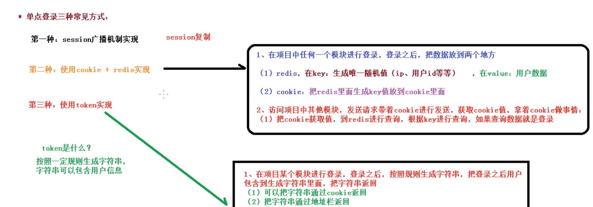
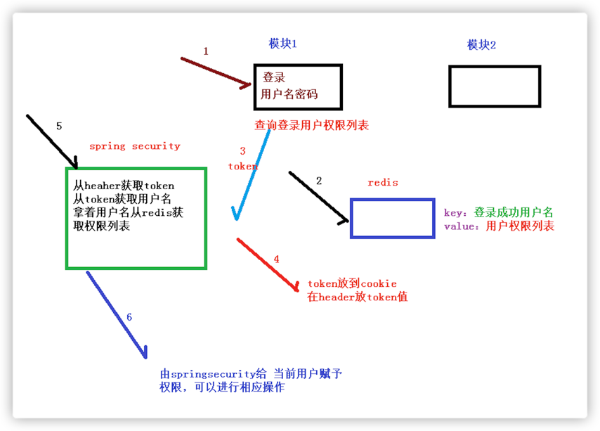
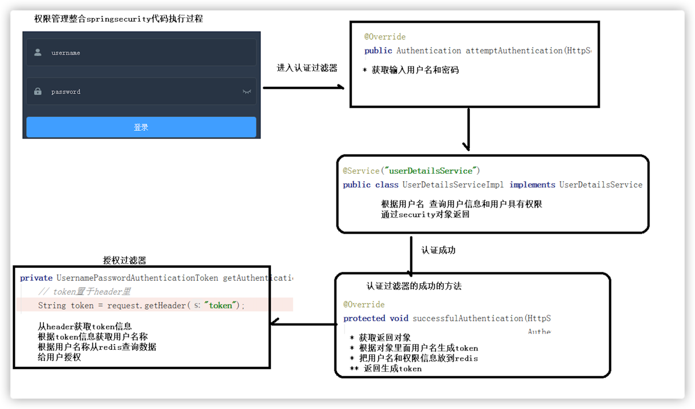
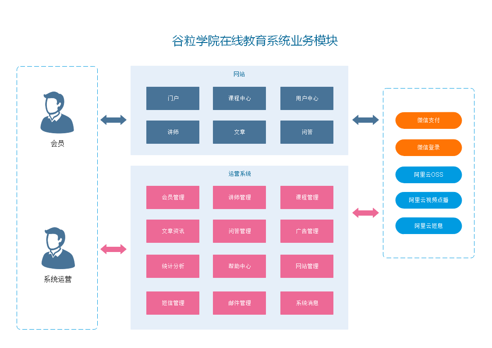
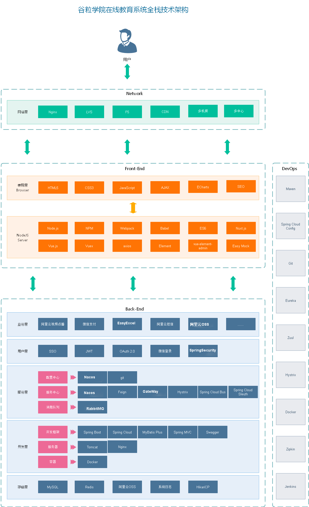
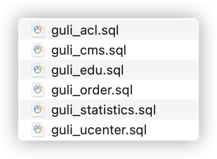
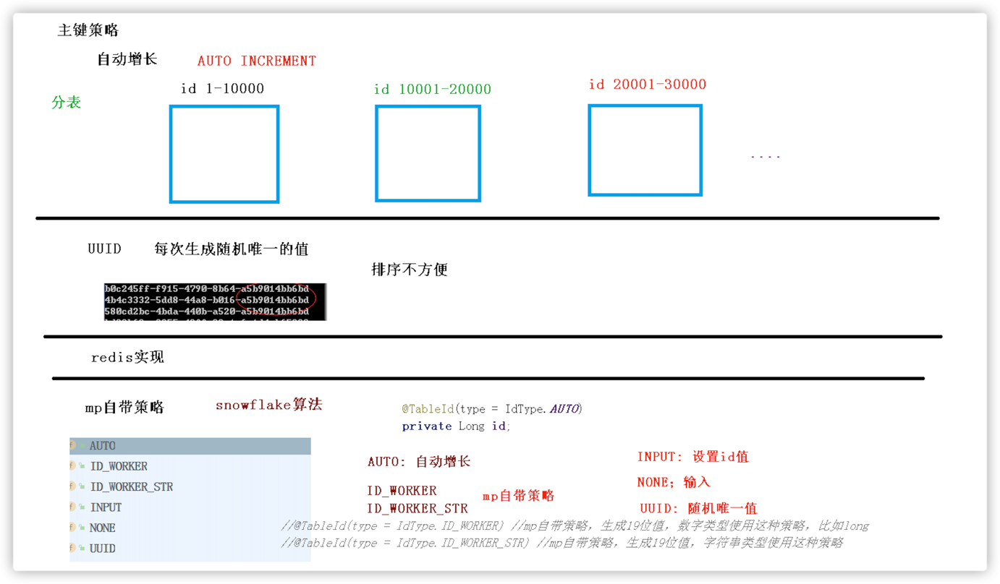
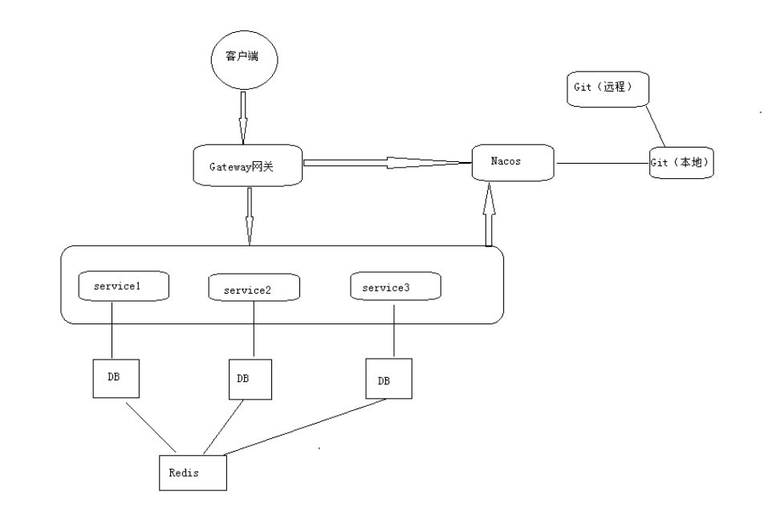

# 谷粒学院——项目总结

### 一、项目的功能点

#### 1、后台管理系统功能

##### 1.1 登陆注册功能（SpringSecurity 框架）

##### 1.2 权限管理功能

- 菜单管理：CRUD
- 角色管理：CRUD、批量删除、为角色分配菜单
- 用户管理：CRUD、为用户分配角色
- 表和表的关系：使用五张表【用户表、角色表、菜单表、用户角色表、角色菜单中间表】

##### 1.3 讲师管理模块

多条件分页查询、CRUD

##### 1.4 课程分类模块

- 添加课程分类：读取 Excel 里的课程数据，添加到数据库中，通过easyExcel
- 课程分类列表：使用树形结构显示课程分类列表

##### 1.5 课程管理模块

- 课程列表功能
- 添加课程
- 添加小节时，可以上传课程

1. 课程发布的流程

   > 填写课程基本信息 ——> 添加课程大纲（章节和小节）——> 课程信息确认 ——> 最终发布

2. 课程如何判断是否已经发布？

   > 通过给数据库设置字段 status 来判断他现在的状态

3. 课程添加过程中，中途把课程停止添加，重新去添加新的课程，如何找到之前没有发布完成的课程，继续发布呢？

   > 到课程列表中选择 status 为未发布的课程，里面会有程信息，然后导出到编辑页面，继续编辑 ——> 发布完成。

##### 1.6 统计分析模块

- 生成统计数据
- 统计数据的图标显示

##### 1.7 走马灯模块

- 添加和删除

#### 2、前台系统功能

##### 2.1 首页数据显示

- 显示走马灯功能
- 显示热门课程
- 显示名师

##### 2.2 注册功能

- 获取手机验证码

##### 2.3 登陆功能

1. 普通登录

    - 你项目使用的是SSO（单点登录）实现登录的吗？是怎么实现的？

      > 我使用的是 token 的方式，用户登录成功后，根据相关的信息生成 token ，然后返回给 cookie ，他每次访问的时候都会从请求头中获取 token 的值，并解析获取用信息，判断是否已经登录
      >
      > 
    - 你是用什么方式生成 Token 的？

      > 使用 Jwt 生成 token 字符串

    - Jwt 由几部分组成，分别为什么？

      > Jwt 由三部分组成，分别为：jwt头、有效载荷（用户信息）、签名哈希（防伪标志）

    - 你登录功能的实现流程是什么？

      > 调用登录的接口，会返回一个 token 字符串，把 token 字符串放到 cookie 中，创建前端拦截器进行判断，如果 cookie 里包含token 字符串，把 token 放到 header 中。调用接口会从 header 中取值到 token ，根据 token 值获取到用户信息，然后在页面中进行显示

2. 微信扫码登录

    - OAuth2 是什么？

      > 只是一种解决方法，按照一种规则，但是具体是什么规则，没有规定
      >
      > 他是一种方案，但不是一种协议

      > OAuth2 主要可以解决两个问题
      >
      > 1. 开放系统间授权
      > 2. 分布式访问问题

    - 你是如何获取扫码人微信信息的？

      > 扫码后，微信会返回两个值 code 和 state ；然后拿着这个 code 去请求微信的固定地址，获得两个值 access_token 访问凭证和openid 每个微信的唯一表示；然后拿着这两个再去请求微信的一个固定地址获取到扫码人的信息。

##### 2.4 名师列表功能

##### 2.5 名师详情功能

##### 2.6 课程列表功能

- 多条件查询分页列表功能

##### 2.7 课程详情功能

- 课程信息显示（包括基本信息、讲师信息、分类信息、大纲信息）
- 判断课程是否需要购买

##### 2.8 课程详细视频在线播放功能

- 阿里云视频点播、阿里云播放器
- 需要传入的数据 accessKeyId - id ； accessKeySecret - 密钥 ； title — 上传的文件名称 ； fileName - 本地文件的路径和名称
- 通过官方的示例代码改造出上传功能

##### 2.9 课程支付功能

- 生成课程订单
- 生成微信支付二维码
- 微信最终支付

你的微信支付功能的流程你说说？

> 如果课程是收费课程，点击立即购买，生成课程订单；
>
> 点击订单页面中的去支付，生成微信支付二维码；
>
> 使用微信扫描二维码实现支付；
>
> 支付之后，每间隔 3秒 查询支付状态（是否支付成功），如果没有支付成功就等待，如果支付成功之后，修改订单状态，向支付表中添加记录

### 二、项目的技术点

#### 1、前后端开发分离

后端写接口，前端调后端接口得到数据并显示

#### 2、项目使用技术【前端】

##### 2.1 vue

- 基本语法
- 指令：
    - v-bind 简写`：`
    - v-model
    - v-for
    - v-if
    - v-html
- 生命周期
    - created()，页面渲染之前
    - mounted()，页面渲染之后
- 绑定事件
    - v-on 简写 `@`
- ES6 规范，通过 babel 转成 ES5，框架自带

##### 2.2 Element-UI

##### 2.3 Node.js

> js运行环境，不需要浏览器直接运行代码，模拟服务器效果

##### 2.4 npm

包管理工具，类似Maven

- npm命令
    - npm run dev 运行程序
    - npm init 初始化
    - npm install 依赖名

##### 2.5 Babel

> 转码器，很多浏览器对 ES6 的兼容性不是很好，需要把 ES6 转换成 ES5 代码运行。

##### 2.6 前端模块化

- 通过一个页面或 js 去调用另外一个页面的 js 文件的方法
- ES6 语法不能在 Node.js 中直接使用，需要通过 babel 编译成 ES5 再执行

##### 2.7 后台系统使用 vue-admin-template

> 基于vue、Element-ui、9528端口

##### 2.8 前台系统使用 Nuxt

> 基于Vue，3000端口，服务器渲染技术

##### 2.9 Echarts

> 图表工具

你能做全栈吗？

> 项目中的大部分后端都是我写的，前端是在各个框架的基础上修改的，对前端的了解限于看得懂，会用，并不算真正的熟练。

#### 3、项目使用技术【后端】

##### 3.1 微服务架构

> 将项目拆分为独立的模块，每个模块都有其端口号，模块与模块之间没有关系，是通过远程调用实现的。

##### 3.2 SpringBoot

SpringBoot 本质就是 spring，只是快速构建 Springboot 工程的脚手架。

- 启动类包扫描机制

  从外往里扫，也可以设置扫描机制，通过 `@ComponentScan(包路径)`

- 配置类 SpringBoot 配置文件类型
    - properties
    - yaml
- 配置文件加载机制
    - 先 bootstrap
    - 再 properties 或 yaml
    - 再对应的环境如：dev、test、prod

##### 3.3 SpringCloud

- 是很多框架的总称，基于 springboot 实现
- 组成的框架由：
    - eureka 服务注册，nacos
    - OpenFeign 服务调用
    - Hystrix 熔断器
    - Gateway 网关
    - Config 配置中心，nacos
    - Bus 消息总线，nacos
- 项目中，使用 阿里巴巴nacos 代替 springcloud 一些组件
- Nacos
    - 注册中心
    - 配置中心
- Feign
    - 服务调用，一个微服务调用另外一个微服务，实现远程调用
- 熔断器
- Gateway网关，之前是zuul
- 版本：
    - Finchley 2.0.x
    - Greenwich 2.1.x
    - Hoxton 2.2.x

##### 3.4 MyBatisPlus

MyBatisPlus就是对MyBatis的增强，本身并没改变

- 自动填充
- 乐观锁
- 逻辑删除
- 代码生成器

##### 3.5 EasyExcel

- 阿里巴巴提供操作Excel工具，效率高，代码简洁

  > EasyExcel 对 poi 进行封装，采用 SAX 方法（一行一行操作）进行解析
  >
  > Dom：一次将所有数据放进内存中来

- 项目应用在添加课程分类，读取 excel 数据

##### 3.6 SpringSecurity

1. 项目整合框架实现权限管理功能。框架组成：

- 认证（登录）
- 授权（对用户授予权限）
- 登录认证过程

2. 说一说 SpringSecurity 的登录认证过程？
   
3. 代码执行过程
   

todo

##### 3.7 Redis

- 首页数据通过Redis做缓存

- Redis数据类型：

    - Set
    - List
    - Hash
    - String
    - zset

- Redis做缓存，什么样的数据适合使用Redis做缓存？

  > 经常访问，但不经常修改的数据，如主页。

##### 3.8 Nginx

- 方向代理服务器
- 请求转发、负载均衡、动静分离

##### 3.9 OAuth2 + JWT

- 针对特定问题的解决方案
- Jwt 制定一种规则生成字符串，包括三部分：
    - JWT 头
    - 有效载荷（用户信息）
    - 防伪标志

##### 3.10 HttpClient

- 模拟浏览器，请发请求响应的工具
- 项目中应用场景：微信登录获取扫描人信息，微信支付查询支付状态

##### 3.11 Cookie

特点：

- 客户端技术，存储在浏览器、客户端中
- 每次发送请求，都会带着 cookie
- cookie 有默认有效时长，默认关闭浏览器就不存在了，也可以设置时长，会话级别

##### 3.12 微信登录

##### 3.13 微信支付

##### 3.14 阿里云 OSS

- 文件存储
- 添加讲师，上次讲师头像

##### 3.15 阿里云视频点播

- 视频上传、视频删除、视频播放
- 整合阿里云视频播放器播放
- 使用视频播放凭证播放

##### 3.16 阿里云短信服务

- 注册时，发送手机验证码，存储到 redis 中校验

##### 3.17 git

- 代码提交到远程的 git 仓库中

##### 3.18 Docker + Jenkins

- 手动打包
- idea工具打包
- 自动化部署过程

##### 3.19 swagger2

- 前后端集成联调，前端或者后端无法做到“及时协商，尽早解决”，最终导致问题集中爆发
- swagger2 解决这个问题，管理API接口，生成API文档 + 测试 （postman）

swagger通过注解表明该接口会生成文档，包括接口名、请求方法、参数、返回信息的等等。

- @Api：修饰整个类，描述Controller的作用
- @ApiOperation：描述一个类的一个方法，或者说一个接口
- @ApiParam：单个参数描述
- @ApiModel：用对象来接收参数
- @ApiModelProperty：用对象接收参数时，描述对象的一个字段
- @ApiImplicitParam：一个请求参数
- @ApiImplicitParams：多个请求参数

### 三、项目遇到的问题

#### 1、前端问题——路由切换问题

- 多次路由跳转到同一个页面，created()只执行一次
- 解决方案：通过vue监听机制解决

```javascript
watch:{//监听
    $route(to, from)
    { //路由变化方式，路由发生变化，方法就会执行
        this.init()
    }
}
,
```

#### 2、前端问题—— ES6 模块化问题

- 使用 Babel 把 ES6 代码转换为 ES5 的代码运行

#### 3、MyBatisPlus 生成 19 位 id 值问题

- mp 生成的 id 值为 19 位，js 处理数据类型值时，只处理 16 位
- 解决方案：将 long 改为 string 类型

#### 4、跨域问题

- 访问协议 || ip地址 || 端口号，三者有任何一个不一样，就会产生跨域问题
- 解决方案：
    - 在 controller 添加注解 `@CrossOrigin`
    - 通过 Gateway 网关解决，写一个配置类
    - 上面只能使用一个，不然会失效

#### 5、413 问题

- 上传视频时，nginx 有上传视频大小限制，如果超过，就会出现 `413` 错误
- `413` 描述：请求体过大
- 解决方案：在 nginx 里配置客户端提交文件大小
- 响应状态码：413、跨域403、重定向302

#### 6、Maven 加载问题

- Maven 加载项目时，不会加载 src-java 文件夹里面的 xml 类型文件
- 解决方案：
    - 1、复制 xml 文件到 target 目录
    - 2、在 Maven 中配置，与 properties 配置文件中指定 xml 文件夹

### 四、项目面试总结

#### 1、项目描述

1. 项目总体介绍

   > 谷粒学院，是一个 B2C 模式的职业技能在线教育系统，分为前台用户系统和后台运营平台。使用微服务架构，项目采用前后端分离开发。

2. 项目功能模块

   在线教育项目分为前台系统和后台系统。

    - 前台系统包含：首页数据显示、课程列表和详情、课程支付、课程视频播放、微信登录、微信支付等等；
    - 后台系统包含：权限管理、课程管理、统计分析、课程分类等等。

   我在这个项目负责todo 前台微信登录和支付。后台权限管理和统计分析。

3. 项目设计技术

   项目采用前后端分离开发

    - 前端技术包含：vue、element-ui、nuxt、babel等等；
    - 后端技术包含：SpringBoot、SpringCloud、MyBatisPlus、EasyExcel等等；
    - 第三方技术包含：阿里云OSS、视频点播、短信服务等等。

4. 系统模块
   
5. 系统架构
   

#### 2、这是一个项目还是一个产品

是一个产品。项目是从 0 开始搭建的。

#### 3、测试要求

用每秒查询率来衡量域名系统服务器的机器性能，称为 QPS。QPS = 并发量 / 平均响应时间。

首页和视频详情页QPS 单机 QPS 要求 2000+

#### 4、企业中的项目（产品）开发流程

一个中大型项目的开发流程

1. 需求调研（产品经理）
2. 需求评审（产品 / 设计 / 前端 / 后端 / 测试 / 运营）
3. 立项
4. UI 设计
5. 开发
    - 架构、数据库设计、API 文档、MOCK 数据、开发、单元测试
    - 前端
    - 后端
6. 前后端联调
7. 项目提测：黑盒白盒、压力测试（QPS）、loadrunner
8. bug 修改
9. 回归测试
10. 运维和部署上线
11. 灰度发布
12. 全量发布
13. 维护和运营

#### 5、系统中有哪些角色？数据库是怎么设计的？

- 前台：会员（学员）
- 后台：系统管理员、运营人员
- 后台分库，每个微服务一个独立的数据库，使用了分布式 id 生成器，用到了 5 个数据库
  
- 数据库中一共用到的表：todo
- guli_acl
- guli_cms
- guli_edu
  - edu_course 课程表：存储课程信息
  - edu_course_description 课程简介表：存储课程简介信息
  - edu_chapter 课程章节表：存储课程章节信息
  - edu_video 课程小节表：存储章节中小节的信息
  - edu_teacher 讲师表
  - edu_subject 分类表
- guli_order
- guli_statistics
- guli_ucenter

#### 6、视频点播是怎么实现的？（流媒体你们是怎么实现的？）

- 我们直接接入了阿里云的云视频点播。云平台上的功能包括视频上传、转码、加密、智能审核、监控统计等。
- 还包括视频播放功能，阿里云提供了一个视频播放器。

#### 7、前后端联调经常遇到的问题？

- 请求方式post、get
- json、x-wwww-from-urlencoded 混乱的错误
- 后台必要的参数，前端省略了
- 数据类型不匹配
- 空指针异常
- 分布式系统中分布式 id 生成器生成的 id 长度过大（19 个字符长度的整数），js 无法解析（js 只能解析 16 个长度：2^53），id 策略改成 ID_WORKER_STR

#### 8、前后端分离项目中的跨域问题？

- 后端服务器配置：我们的项目中是通过 Springboot 注解解决跨域问题的。在 Controller 上添加注解 @CrossOrigin
- 也可以使用 nginx 反向代理、httpClient、网关

#### 9、说说你做了哪个部分、遇到了什么问题、怎么解决的

1. 分布式id生成器在前端无法处理，总是在后三位进行四舍五入。

   > 分布式 id 生成器生成的 id 是 19 个字符的长度，前端 javascript 脚本对整数的处理能力只有 2的53次方，也就是最多只能处理 16 个字符。解决的方案是把 id 在程序中设置成了==字符串==的性质。

2. 项目迁移到 Springboot-Cloud 的时候，经过网关时，前端传递的 cookie ，后端一直获取不了。

   > 看了 cloud 中 zuul 的源码，发现向下游传递数据的时候，zull 默认过滤了敏感信息，将 cookie 过滤掉了。解决的方案是在配置文件中将请求头的过滤清除掉，使 cookie 可以向下游传递。

3. nginx 会出现多开情况

   > nginx.exe 和其他程序不一样，直接关闭并不是真正的关闭，在每次使用完之后使用`nginx -s stop`或者`nginx -s quit`关闭。或者直接重启电脑

4. 在课程分类管理模块的时候，因为前端调用的是 Element-ui 的组件，需要传入的数据格式很奇怪，是 json 嵌套另一个 json 的数据，当时在后端的实现上费了不少功夫
   > 看着前端给的数据格式，一层一层的加入
5.

#### 10、分布式系统的 id 生成策略

[[分布式系统唯一ID生成方案汇总](https://www.cnblogs.com/haoxinyue/p/5208136.html)](https://www.cnblogs.com/haoxinyue/p/5208136.html)

1. 数据库自增长序列或字段
2. UUID
3. UUID 的变种 UUID to Int64
4. Redis 生成 ID
5. Twitter 的 snowflake 算法（雪花算法）
6. 

#### 11、项目组有多少人，人员如何组成

#### 12、分布式系统 CAP 原理

1. 原理

   > 在理论计算机科学中，CAP 原理指出对于一个分布式系统来说，当设计读写操作时，只能同时满足以下三点中两个：

    - 一致性（Consistence）：所有节点访问同一份最新的数据副本；
    - 可用性（Avaliability）：非故障的节点在合理时间内返回合理的响应（不是错误或者超时的响应）；
    - 分区容错性（Partition
      tolerance）：分布式系统出现网络分区（分布式系统中，多个节点之前的网络本来是连通的，但是由于某些故障，比如部分节点网络出了问题。某些节点之间不连通，整个网络就分为几个区域，这就叫做网络分区。）的时候，仍然能够对外提供服务。

2. CA 满足的情况下，P 不能满足的原因

   > 数据同步（C）需要时间，也要正常的时间内响应（A），那么机器的数量就要减少，所以 P 就不满足；

3. CP 满足的情况下，A 不能满足的原因

   > 数据同步（C）需要时间, 机器数量也多（P），但是同步数据需要时间，所以不能在正常时间内响应；

4. AP 满足的情况下，C 不能满足的原因

   > 机器数量很多（P）上都备份上同样的数据，保持数据的一致性（C），我们想象10000台设备数据的同步必然是需要消耗时间，那么我们就没办法实现（A），所以要想实现（AP）那，就不可能保证数据的一致性的。

5. Zookeeper

   > CP 设计，保证了一致性，集群搭建的时候，某个节点失效，则会进行选举行的 leader，或者半数以上节点不可用，则无法提供服务，因此可用性（A）没法满足。

6. Eureka

   > AP 原则，无主从节点，一个节点挂了，自动切换其他节点可以使用，去中心化（C）

7. 结论

    - 分布式系统中P,肯定要满足，所以我们只能在一致性和可用性之间进行权衡
    - 如果要求一致性，则选择 zookeeper ，如金融行业
    - 如果要求可用性，则选择 Eureka ，如教育、电商系统
    - 没有最好的选择，最好的选择是根据业务场景来进行架构设计

#### 13、前端渲染和后端渲染有什么区别

- 前端渲染是返回 json 给前端，通过 javascript 将数据绑定到页面上
- 后端渲染是在服务器端将页面生成直接发送给服务器，有利于 SEO 的优化

#### 14、能画一下系统架构图吗？

